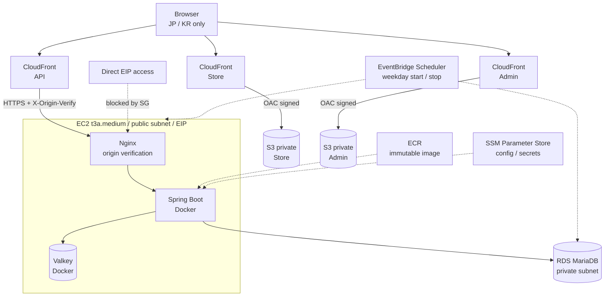
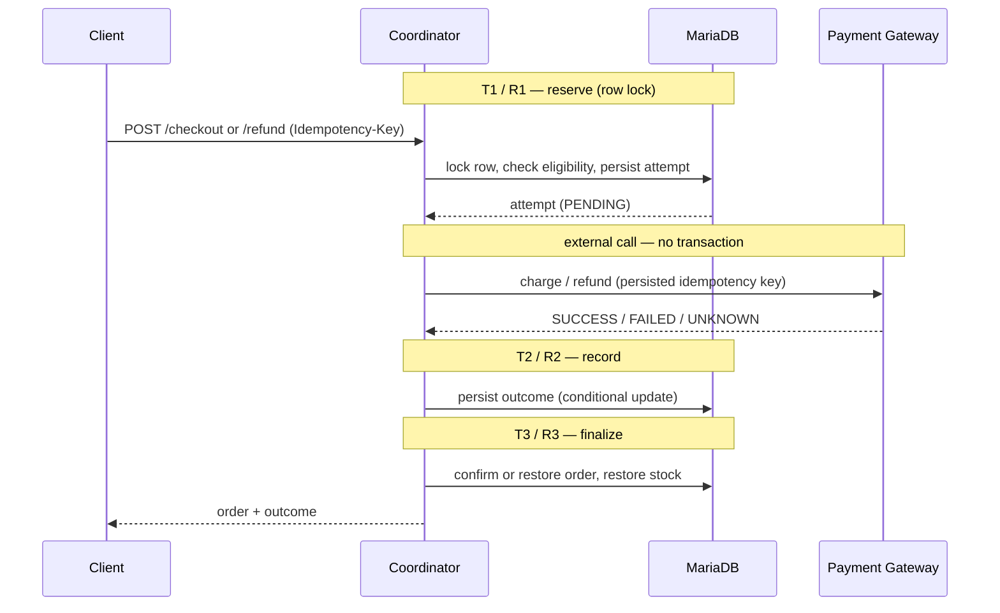
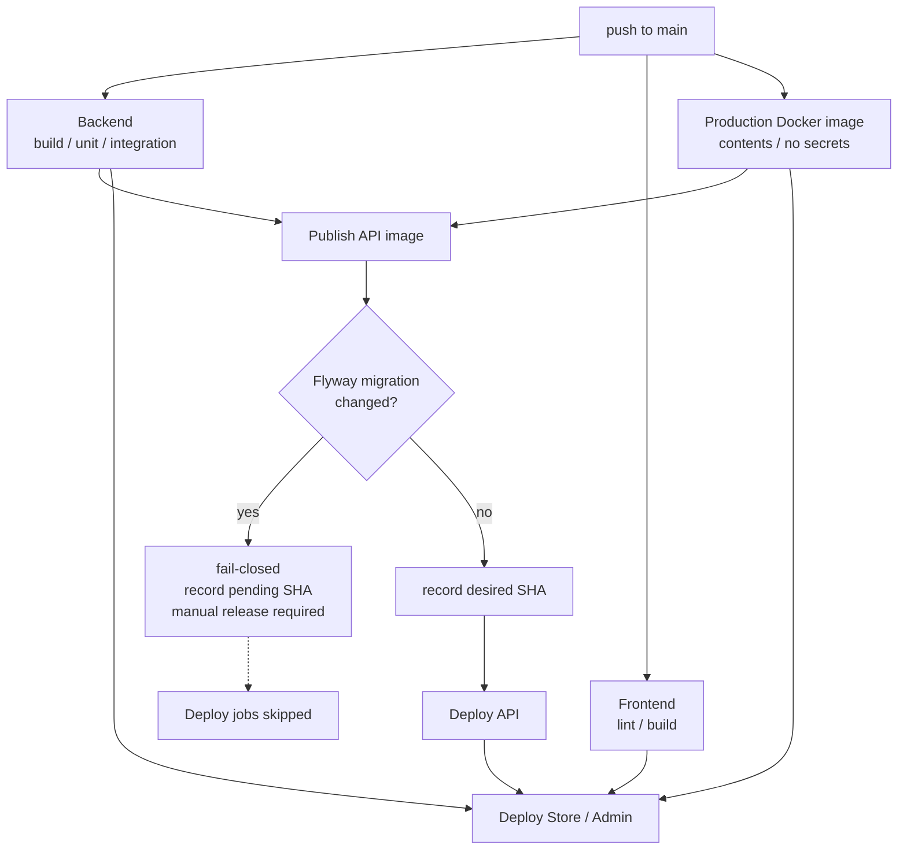

# EC Portfolio

**日本語** | [한국어](docs/README.ko.md) | [English](docs/README.en.md)

        

Kotlin / Spring Boot と React / TypeScript で構築した EC サイトのポートフォリオです。商品・カート・注文の CRUD だけでなく、**決済と返金という「失敗しうる外部呼び出し」を含む処理をどう安全に設計するか**を主題にしています。決済 gateway の応答が失われたら、同じリクエストが二重に届いたら、DB migration を含む release を自動デプロイしてよいか — こうした判断を transaction 境界・idempotency・row lock・release guard として実装しました。

インフラは Terraform で管理し、GitHub Actions から OIDC で AWS へデプロイします。個人ポートフォリオとして月額コストを抑えるため、ALB と NAT Gateway を使わない構成を選んでいます。

## Highlights

- **Transaction 境界を分けた checkout** — 外部 gateway 呼び出しを DB transaction の外に置き、予約・結果記録・確定を独立した transaction に分離
- **返金の orchestration と復旧** — 注文行ロック下で「いま有効な refund attempt」を確認し、古い attempt の replay が新しい返金を壊さないよう保護
- **Idempotency と同時実行制御** — idempotency key、request fingerprint、`SELECT ... FOR UPDATE`、条件付き状態遷移による在庫復元の重複防止
- **Migration guard による fail-closed release** — Flyway migration を含む変更は自動デプロイを停止し、手動 release を要求
- **frontend 先行配信の防止** — migration guard または online な API デプロイの失敗時に、frontend だけが backend より先に出ることを防ぐ
- **Terraform による AWS Demo 環境** — VPC、CloudFront、S3/OAC、EC2、RDS、ECR、Parameter Store、Scheduler を IaC で管理

## Demo

| | URL |
|---|---|
| Store | <https://d39sletn97e89c.cloudfront.net> |
| Admin | <https://d1ap338mlg8v7d.cloudfront.net> |
| API | <https://d1q0vfmnxby7vo.cloudfront.net> |

> **稼働時間**: コスト最適化のため Demo の runtime は平日のみ起動します。RDS は 09:50 起動 / 17:10 停止、EC2 は 10:00 起動 / 17:00 停止（JST、`infra/terraform/demo/scheduler.tf`）。API が利用できるのはおおむね平日 10:00〜17:00 JST で、起動と readiness の状況により多少前後します。Store / Admin は S3 + CloudFront のため常時参照できます。
>
> **リリース反映**: DB migration を含む release は安全確認のため手動 release の対象となり、Demo への反映が main より遅れる場合があります。

UI の既定表示は日本語で、Store / Admin ともに画面上で日本語と韓国語を切り替えられます。

## Architecture

### Current Demo Architecture



| Component | 役割 |
|---|---|
| CloudFront | Store / Admin / API を別 distribution で配信。TLS 終端、JP/KR geo restriction、API は `Idempotency-Key` を含む必要な header のみ origin へ転送 |
| S3 | Store / Admin の静的成果物を private bucket に保持。public access は遮断し、閲覧者への配信経路は CloudFront OAC に限定 |
| EC2 | 単一 instance。Nginx が `X-Origin-Verify` を検証し CloudFront 以外の直接アクセスを遮断。Spring Boot と Valkey は private Docker network 上のコンテナ |
| RDS | MariaDB 10.11、private subnet、暗号化、public access 無効。アプリは `sslMode=verify-full` で接続 |
| ECR | API イメージを full Git SHA の immutable tag で保持。`latest` は使用しない |
| Parameter Store | runtime 設定と DB password / JWT secret などの SecureString。EC2 instance role から読み取り |
| EventBridge Scheduler | 平日のみ EC2 / RDS を起動・停止し、待機時間の compute コストを削減 |

### Why this architecture

- **ALB と NAT Gateway を使わない** — 低トラフィックの Demo では固定費が価値を上回るため、EC2 を public subnet に置き EIP と Security Group で制御し、RDS は private subnet に残します。
- **CloudFront を前段に置く** — TLS 終端、geo restriction、origin 隠蔽をマネージドで得られ、EC2 の SG は CloudFront prefix list のみ許可します。SG だけでは経路を強制できないため、Nginx が共有 secret header を検証します。
- **immutable なリリース成果物** — image tag は full Git SHA で `latest` を禁止し、実行中のイメージとコミットが常に一対一で対応します。
- **secret を image に入れない** — 設定は runtime 環境変数として注入し、値は Parameter Store の SecureString から instance role で取得します。CI が image 内に secret がないことを検証します。
- **desired state による収束** — デプロイ対象の SHA を Parameter Store に記録するため、EC2 停止中でもデプロイは失敗せず、起動時に systemd unit が収束させます。

### Planned Next Demo Architecture

次の目標は、origin host を**置き換え可能・停止可能な構成にすること**です。

```
CloudFront → HTTPS origin (EIP) → ECS on EC2 Spot
                                    ├─ Spring Boot
                                    └─ Valkey sidecar
                                  → RDS (private)
```

NAT Gateway を使わないコスト方針は維持したうえで、単一の長寿命 EC2 instance から、停止・置換を前提とした task ベースの構成へ移すことを目標にしています。

その前提として、**origin TLS state の永続化**を準備しています。Let's Encrypt の証明書と ACME account を private S3 に tar で保持し、host が置き換わっても再発行せず復元する仕組みです。boot ごとに発行すると duplicate certificate の rate limit に到達するためです。

> ECS / Spot の Terraform 実装はまだリポジトリに存在せず、上記は設計方針です。ALB + ECS/Fargate + Multi-AZ を含む長期的な production 参照設計は [aws-production.md](docs/architecture/aws-production.md) にあります。

## Core Features

main branch に実装済みの機能です。

| 領域 | Store | Admin |
|---|---|---|
| 認証 | 会員登録 / ログイン（JWT） | 管理者ログイン、`ROLE_ADMIN` によるルートガード |
| 商品 | 一覧・詳細、キーワード検索、価格帯フィルタ、並び替え、ページネーション | CRUD、在庫・公開状態の管理 |
| カテゴリ | 絞り込み | CRUD |
| カート | Valkey 上で保持。追加 / 数量変更 / 削除 / 全消去 | — |
| Checkout | カートから注文を作成し決済。金額はサーバー側でカートから算出 | — |
| 注文 | 一覧 / 詳細、未決済の legacy 注文のキャンセル | 一覧 / 詳細、サーバー側の遷移表に従う状態変更 |
| Refund | 返金申請、未確定の返金の再開（reconcile） | 顧客が開始した返金を含む処理と reconcile |

## Backend Design Highlights

### Checkout と Refund の orchestration

決済 gateway の呼び出しを DB transaction の内側に置くと、ネットワーク待ちの間ロックを保持し続けます。そのため外部呼び出しを transaction の外に出し、その前後を独立した transaction に分割しています。後続の失敗が、先に確定した事実を巻き戻さないようにするためです。各段階は個別の Spring bean として実装しています。同一クラス内の呼び出しでは proxy を経由せず `@Transactional` の境界が失われるためです。



### Idempotency, 同時実行制御, 復旧

- **Idempotency key と request fingerprint** — 同じ key での再送は元の結果を再生します。同じ key で異なる内容（金額や対象の charge）が送られた場合は fail-closed で拒否します。
- **Row lock** — 顧客とオペレーターが同じ注文を同時に操作しても、同一の注文行のロックを奪い合うため、返金は一つしか開始されません。
- **古い attempt の保護** — 返金の確定処理は注文行のロック下で「いま有効な attempt」を DB に問い合わせます。拒否された過去の attempt が replay されても、新しい返金が確保した `REFUND_PENDING` を解除しません。
- **在庫復元の重複防止** — 在庫を戻すのは条件付き UPDATE が実際に状態を遷移させた transaction だけです。同じ処理を再実行しても在庫は増えません。
- **未確定の扱い** — gateway が結果を返さなかった場合、注文はキャンセルも解放もせず保留します。返金が確定していないのに在庫を戻すことも、返金済みかもしれない注文を出荷可能に戻すことも避けるためです。
- **server-side reconcile** — client が idempotency key を失っても、サーバーに保存された attempt の key で処理を再開できます。保存された key を client に返すことも、新しい key を既存 attempt に結び付けることもしません。
- **既知のトレードオフ** — checkout の最終段であるカート整理は best-effort です。決済・注文・在庫が確定した後、カート整理の前にプロセスが落ちると、購入済みの行がカートに残ることがあります。transaction 境界を意図的に分けた結果であり、再試行のたびにカートを引き直して顧客の追加分を消すよりも安全だと判断しています。

## Database & Migration Safety

- **Flyway forward migration** — down script を持たず、前進のみで運用します。
- **不変条件を DB 制約で担保** — 注文 status の CHECK、返金済み attempt には provider の参照 ID が必須、1 注文に成功した charge は 1 件まで、といった条件をアプリケーションではなく DB 側で保証します。
- **既存データを持つ DB の upgrade を検証** — Testcontainers で実際の MariaDB に対し migration を検証します。空のテーブルでは、データを書き換える migration の順序の誤りが検出できないためです。
- **DDL は 1 statement にまとめる** — MariaDB は DDL をロールバックしないため、CHECK 制約の差し替えは `DROP` と `ADD` を分けず単一の `ALTER TABLE` で行います。途中で失敗して制約が消えた状態になるのを避けるためです。

## CI/CD & Release Safety



- **Production image の検証** — 実行イメージに JAR 以外のビルド成果物が残っていないこと、RDS の CA bundle が正しい権限で存在すること、環境変数やレイヤー履歴に secret が含まれないことを CI が確認します。
- **Migration guard** — 最後に正常稼働した release と今回の commit の間に Flyway の migration ファイルまたは設定の差分があれば、自動デプロイを停止します。対象 SHA は「保留中の migration release」として Parameter Store に記録され、手動 release の入力になります。
- **3 つの release state** — 「デプロイすべき SHA」「最後に正常稼働した SHA」「migration 待ちの SHA」を Parameter Store で管理します。ロールバック先が存在しない release は publish 時点で拒否します。
- **desired state への収束** — EC2 が停止中でもデプロイ job は失敗せず、対象 SHA を記録して終了します。起動時に systemd unit がその SHA へ収束させます。
- **frontend / backend の順序** — frontend のデプロイは API のデプロイ成功を前提とします。migration guard で止まった release や online な host へのデプロイが失敗した release で frontend だけが先行すると、稼働中の backend に存在しない endpoint を呼び出すためです。ただし host が offline の場合、API のデプロイは desired SHA を記録して正常終了するため frontend が先に出ます。この場合は host の起動後に backend が収束するまでの一時的な window が生じます。
- **short-lived credential** — GitHub Actions は OIDC で AWS role を assume します。static な access key は保存していません。

## Security

| 領域 | 実装 |
|---|---|
| 認証 / 認可 | JWT。`/api/admin/**` は `ROLE_ADMIN`、ユーザーは自分の注文のみ操作可能 |
| 情報漏洩の抑止 | 他人の注文への操作は「権限なし」ではなく「存在しない」として応答し、ID の実在を推測させない |
| DB 接続 | `sslMode=verify-full` と RDS Tokyo CA bundle。system trust store への fallback を無効化 |
| Cache 接続 | Demo では Valkey を host に公開せず、Spring Boot と同一 host の private Docker network 内からのみ到達させます。この構成では TLS と認証を使わない Demo 限定の明示的な例外としています。production profile では Valkey の TLS と username / password を必須にします |
| Secret | image に含めず、Parameter Store の SecureString から instance role で取得 |
| Container | multi-stage build、non-root 実行 |
| API ドキュメント | OpenAPI UI は production profile で既定無効 |
| ネットワーク | RDS は private。EC2 への直接アクセスは SG で遮断し、Nginx が origin header を検証 |
| AWS 認証 | GitHub OIDC による短期認証情報のみ |

## Tech Stack

| Layer | Technology |
|---|---|
| Backend | Kotlin 2.0, Spring Boot 3.5, Java 21 |
| Persistence | MariaDB 10.11, MyBatis, Flyway |
| Cache / Session | Valkey (Redis protocol) |
| Frontend | React 19, TypeScript, Vite, React Router, i18next |
| Infrastructure | AWS (CloudFront, S3, EC2, RDS, ECR, SSM, EventBridge), Terraform |
| CI/CD | GitHub Actions, GitHub OIDC |
| Runtime | Docker, Nginx |
| Testing | JUnit 5, Testcontainers, Vitest |

## Repository Structure

```
apps/api          Kotlin / Spring Boot API（domain / application / infra / presentation）
apps/store-web    Store frontend（React + TypeScript）
apps/admin-web    Admin frontend（React + TypeScript）
packages          workspace 共有パッケージ（contracts / i18n / ui / config）
infra/terraform   AWS Demo 環境の Terraform
infra/runtime     デプロイ・収束・ホスト設定スクリプトとその検証スイート
docs              アーキテクチャ設計と ADR
```

## Local Development

Docker Desktop と Node.js 22 が必要です。backend をローカルで直接起動する場合のみ Java 21 を使います。

```zsh
git clone git@github.com:nagi4757/ec-portfolio.git
cd ec-portfolio
npm install
cp .env.example .env            # DB / JWT などのローカル値を設定

docker compose up -d            # API + MariaDB + Valkey
npm run dev:store               # Store
npm run dev:admin               # Admin
```

Flyway の migration は起動時に自動適用されます。Java 21 で backend を直接起動する場合は次のとおりです。

```zsh
cd apps/api
set -a && source ../../.env && set +a
./gradlew bootRun
```

デプロイと運用手順は [infra/runtime/demo/README.md](infra/runtime/demo/README.md)、インフラ構成は [infra/terraform/demo/README.md](infra/terraform/demo/README.md) を参照してください。

## Testing

```zsh
cd apps/api
./gradlew test                  # unit
./gradlew integrationTest       # Testcontainers（MariaDB と Redis 7 を起動）

npm run test  --workspace=store-web
npm run lint  --workspace=store-web
npm run build --workspace=store-web
```

`integrationTest` には checkout / refund の orchestration、同時実行、DB 制約、migration upgrade の検証が含まれます。デプロイスクリプトは `infra/runtime/demo/*.test.sh` に独自の検証スイートを持ち、CI から実行されます。

## Status & Roadmap

**Completed** — 認証・商品・カテゴリ・検索・カート・注文、Checkout と決済 orchestration、Refund orchestration と server-side reconcile、AWS Demo 環境の Terraform 化、GitHub OIDC による自動デプロイ、migration guard と release state 管理、起動時収束

**In Progress** — 置き換え可能な origin host の前提となる origin TLS state 永続化の準備

**Planned**

- ECS on EC2 Spot と Valkey sidecar への移行
- 実決済 provider adapter の導入。現在は mock gateway であり、同一 idempotency key の replay 保証または provider の status lookup のいずれかを導入前に確認する必要があります

## Documentation

- [Demo AWS Architecture](docs/architecture/aws-demo.md) — Demo 環境の設計意図、ネットワーク境界、コスト試算
- [Production AWS Architecture](docs/architecture/aws-production.md) — 本番想定の参照設計
- [ADR-001](docs/adr/ADR-001-cost-optimized-demo-aws.md) — Demo で ALB / ECS / NAT Gateway を採用しなかった判断
- [Runtime deployment](infra/runtime/demo/README.md) / [Terraform](infra/terraform/demo/README.md) — 運用手順とインフラ構成
