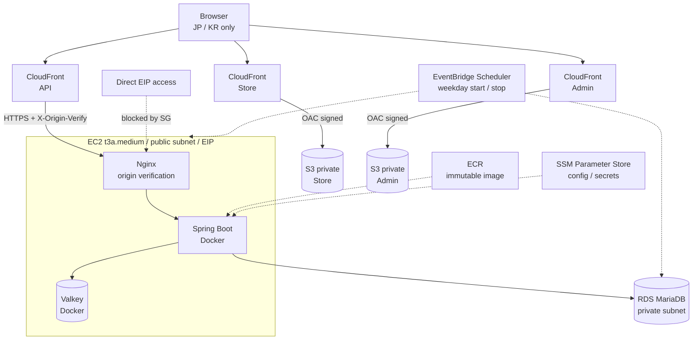
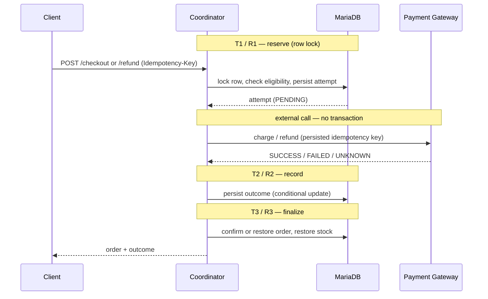
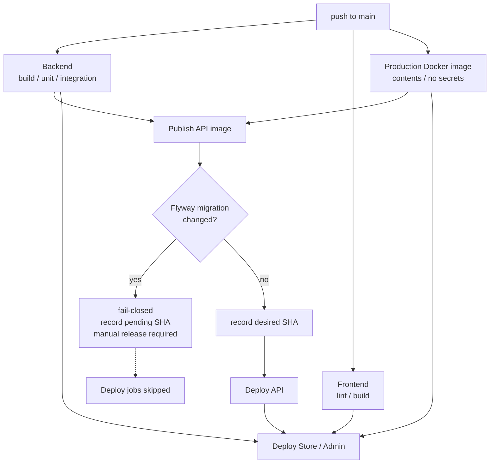

# EC Portfolio

[日本語](../README.md) | [한국어](README.ko.md) | **English**

        

An e-commerce portfolio built with Kotlin / Spring Boot and React / TypeScript. Rather than stopping at CRUD for products, carts and orders, it is about **how to design the parts that can fail: payment and refund, where an external call sits in the middle of a business transaction**. What happens when the gateway's response is lost, when the same request arrives twice, or when a release contains a database migration — those decisions are implemented here as transaction boundaries, idempotency, row locks and release guards.

The infrastructure is managed with Terraform and deployed to AWS from GitHub Actions over OIDC. Because this is a personal portfolio with a monthly cost ceiling, it deliberately runs without an ALB or a NAT Gateway.

## Highlights

- **Checkout split across transaction boundaries** — the external gateway call sits outside any database transaction, with reservation, result recording and finalisation committing independently
- **Refund orchestration and recovery** — finalisation asks, under the order row lock, which refund attempt currently speaks for the order, so a replayed older attempt cannot break a newer refund
- **Idempotency and concurrency control** — idempotency keys, request fingerprints, `SELECT ... FOR UPDATE` and guarded state transitions prevent duplicate stock restoration
- **Fail-closed releases behind a migration guard** — a change touching Flyway migrations stops automatic deployment and requires a manual release
- **Frontend cannot ship ahead of the API** — a release stopped by the migration guard, or whose deployment to an online host failed, does not ship its frontend either
- **AWS demo environment as code** — VPC, CloudFront, S3/OAC, EC2, RDS, ECR, Parameter Store and Scheduler are all managed in Terraform

## Demo

| | URL |
|---|---|
| Store | <https://d39sletn97e89c.cloudfront.net> |
| Admin | <https://d1ap338mlg8v7d.cloudfront.net> |
| API | <https://d1q0vfmnxby7vo.cloudfront.net> |

> **Operating window**: to keep costs down, the demo runtime starts on weekdays only — RDS at 09:50 and stopping at 17:10, EC2 at 10:00 and stopping at 17:00 JST (`infra/terraform/demo/scheduler.tf`). The API is usable roughly between 10:00 and 17:00 JST on weekdays, shifting slightly with startup and readiness. Store and Admin are served from S3 + CloudFront and stay reachable.
>
> **Release timing**: a release containing a database migration goes through a manual release for safety, so the demo can lag behind `main` for a while.

The UI defaults to Japanese, and both Store and Admin let you switch between Japanese and Korean in the interface.

## Architecture

### Current Demo Architecture



| Component | Responsibility |
|---|---|
| CloudFront | Separate distributions for Store, Admin and API. TLS termination, JP/KR geo restriction, and an allowlist of headers — including `Idempotency-Key` — forwarded to the origin |
| S3 | Private buckets holding the Store and Admin build output. Public access is blocked and viewer delivery is restricted to CloudFront OAC |
| EC2 | A single instance. Nginx verifies `X-Origin-Verify` so requests that skip CloudFront are refused. Spring Boot and Valkey run as containers on a private Docker network |
| RDS | MariaDB 10.11 in a private subnet, encrypted, not publicly accessible. The application connects with `sslMode=verify-full` |
| ECR | Holds API images under immutable tags that are full Git SHAs. `latest` is never used |
| Parameter Store | Runtime configuration plus SecureStrings for the database password and JWT secret, read through the EC2 instance role |
| EventBridge Scheduler | Starts and stops EC2 and RDS on weekdays, reducing compute cost during idle hours |

### Why this architecture

- **No ALB, no NAT Gateway** — at demo traffic their fixed cost outweighs what they buy, so EC2 sits in a public subnet behind an EIP and security groups while RDS stays private.
- **CloudFront in front** — TLS termination, geo restriction and origin hiding come managed, and the instance's security group admits only the CloudFront prefix list. A security group alone cannot force traffic through CloudFront, so Nginx verifies a shared secret header.
- **Immutable release artefacts** — image tags are full Git SHAs and `latest` is forbidden, so the running image always maps to exactly one commit.
- **No secrets in the image** — configuration is injected as runtime environment variables and read from Parameter Store SecureStrings through the instance role. CI verifies that no secret reaches the image.
- **Desired-state convergence** — the SHA to deploy is recorded in Parameter Store, so a deployment does not fail while the instance is stopped; a systemd unit converges to it at boot.

### Planned Next Demo Architecture

The next goal is to make the origin host **replaceable and interruptible**.

```
CloudFront → HTTPS origin (EIP) → ECS on EC2 Spot
                                    ├─ Spring Boot
                                    └─ Valkey sidecar
                                  → RDS (private)
```

The cost stance of avoiding a NAT Gateway stays; the goal is to move from one long-lived EC2 instance to a task-based runtime that expects to be stopped and replaced.

**Persisting the origin TLS state** is being prepared as a prerequisite for that. The Let's Encrypt certificate tree and ACME account are archived to a private S3 bucket and restored, so a replacement host serves without re-issuing. Issuing on every boot would hit the duplicate certificate rate limit within days.

> No ECS or Spot Terraform exists in the repository yet; the above is the design direction. The long-term production reference with an ALB, ECS/Fargate and multi-AZ is in [aws-production.md](architecture/aws-production.md).

## Core Features

Implemented on `main`.

| Area | Store | Admin |
|---|---|---|
| Auth | Sign-up and login with JWT | Operator login with `ROLE_ADMIN` route guards |
| Products | List and detail, keyword search, price range filter, sorting, pagination | CRUD, stock and availability |
| Categories | Filtering | CRUD |
| Cart | Held in Valkey. Add, change quantity, remove, clear | — |
| Checkout | Creates an order from the cart and charges for it; the amount is computed server-side | — |
| Orders | List and detail, cancellation for unpaid legacy orders | List and detail, transitions enforced by a server-side table |
| Refund | Request a refund and resume an unresolved one (reconcile) | Refund handling and reconcile, including refunds a customer started |

## Backend Design Highlights

### Checkout and refund orchestration

Calling a payment gateway inside a database transaction means holding locks for the length of a network round trip. So the external call is moved out of the transaction, and the work on either side of it is split into transactions that commit independently — a later failure must not roll back a fact that was already settled. Each stage is its own Spring bean, because a call within the same class does not pass through the proxy and the `@Transactional` boundary would be lost.



### Idempotency, concurrency and recovery

- **Idempotency key and request fingerprint** — repeating a request under the same key replays the original outcome; the same key presented with different content, such as a different amount or charge, is refused fail-closed.
- **Row locks** — a customer and an operator acting on the same order contend for the same order row, so only one refund is ever started.
- **Stale attempt protection** — refund finalisation asks the database, under the order lock, which attempt currently speaks for the order. A replayed older attempt cannot release the `REFUND_PENDING` that a newer refund is relying on.
- **No duplicate stock restoration** — stock is only returned by the transaction whose conditional update actually moved the order. Repeating the same call cannot inflate it.
- **Unresolved outcomes** — when the gateway reports nothing, the order is neither cancelled nor released. Cancelling would return goods without knowing the customer was paid; releasing would hide a refund that may already have gone through.
- **Server-side reconcile** — a client that has lost its idempotency key can still resume, because the server drives the stored attempt under the key recorded on it. The stored key is never handed back to the client, and a new key is never attached to an existing attempt.
- **A known trade-off** — clearing the cart is the best-effort tail of checkout. If the process dies after payment, order and stock are settled but before the cart is cleared, the purchased lines can remain in it. That follows from splitting the transaction boundaries deliberately, and is safer than subtracting the cart again on every retry, which would delete items the customer added afterwards.

## Database & Migration Safety

- **Forward-only Flyway migrations** — there are no down scripts; the schema only moves forward.
- **Invariants enforced by the database** — the order status CHECK, "a completed refund must carry the provider's reference", and "an order has at most one successful charge" are constraints in the schema rather than conventions in code.
- **Upgrades of a database that already holds data** — migrations are verified against a real MariaDB via Testcontainers. An empty schema hides ordering mistakes in a migration that rewrites rows.
- **One statement per constraint swap** — MariaDB does not roll DDL back, so replacing a CHECK is a single `ALTER TABLE` rather than a `DROP` followed by an `ADD`, which could otherwise leave the table with no constraint at all.

## CI/CD & Release Safety



- **Production image verification** — CI checks that nothing but the JAR survives into the runtime image, that the RDS CA bundle is present with the right ownership and permissions, and that no secret appears in the environment or the layer history.
- **Migration guard** — if Flyway migration files or configuration differ between the last known good release and the current commit, automatic deployment stops. The SHA is recorded as the pending migration release and becomes the input to a manual one.
- **Three pieces of release state** — the SHA to deploy, the last one known to run, and the one waiting on a migration, all in Parameter Store. A release with no recoverable rollback image is refused at publish time.
- **Convergence to desired state** — a deployment does not fail when the instance is stopped; it records the SHA and exits, and a systemd unit converges to it at boot.
- **Frontend follows the API** — the frontend deployment depends on the API deployment succeeding, so a release stopped by the guard, or one whose deployment to an online host failed, does not ship a storefront calling endpoints the running backend lacks. When the host is offline the API deployment records the desired SHA and exits successfully, so the frontend does go first; a temporary window then remains until the host boots and the backend converges.
- **Short-lived credentials** — GitHub Actions assumes AWS roles over OIDC. No static access keys are stored.

## Security

| Area | Implementation |
|---|---|
| Authentication / authorisation | JWT; `/api/admin/**` requires `ROLE_ADMIN` and customers can only act on their own orders |
| Information disclosure | Acting on someone else's order answers "not found" rather than "forbidden", so order ids cannot be probed |
| Database connection | `sslMode=verify-full` with the RDS Tokyo CA bundle, with the system trust store fallback disabled |
| Cache connection | In the demo, Valkey is not exposed on the host and is reachable only from the private Docker network it shares with Spring Boot. That configuration is an explicit demo-only exception that runs without TLS or authentication. The production profile requires Valkey TLS and a username / password |
| Secrets | Never in the image; read from Parameter Store SecureStrings through the instance role |
| Container | Multi-stage build, runs as a non-root user |
| API documentation | The OpenAPI UI is disabled by default under the production profile |
| Network | RDS is private; direct access to the instance is refused by its security group and Nginx verifies the origin header |
| AWS authentication | Short-lived credentials from GitHub OIDC only |

## Tech Stack

| Layer | Technology |
|---|---|
| Backend | Kotlin 2.0, Spring Boot 3.5, Java 21 |
| Persistence | MariaDB 10.11, MyBatis, Flyway |
| Cache / Session | Valkey (Redis protocol) |
| Frontend | React 19, TypeScript, Vite, React Router, i18next |
| Infrastructure | AWS (CloudFront, S3, EC2, RDS, ECR, SSM, EventBridge), Terraform |
| CI/CD | GitHub Actions, GitHub OIDC |
| Runtime | Docker, Nginx |
| Testing | JUnit 5, Testcontainers, Vitest |

## Repository Structure

```
apps/api          Kotlin / Spring Boot API (domain / application / infra / presentation)
apps/store-web    Store frontend (React + TypeScript)
apps/admin-web    Admin frontend (React + TypeScript)
packages          Shared workspace packages (contracts / i18n / ui / config)
infra/terraform   Terraform for the AWS demo environment
infra/runtime     Deployment, convergence and host configuration scripts with their test suites
docs              Architecture design and ADRs
```

## Local Development

Docker Desktop and Node.js 22 are required. Java 21 is only needed to run the backend directly.

```zsh
git clone git@github.com:nagi4757/ec-portfolio.git
cd ec-portfolio
npm install
cp .env.example .env            # local database and JWT values

docker compose up -d            # API + MariaDB + Valkey
npm run dev:store               # Store
npm run dev:admin               # Admin
```

Flyway migrations are applied on startup. To run the backend directly with Java 21 instead:

```zsh
cd apps/api
set -a && source ../../.env && set +a
./gradlew bootRun
```

Deployment and operational procedures live in [infra/runtime/demo/README.md](../infra/runtime/demo/README.md); the infrastructure itself is documented in [infra/terraform/demo/README.md](../infra/terraform/demo/README.md).

## Testing

```zsh
cd apps/api
./gradlew test                  # unit
./gradlew integrationTest       # Testcontainers (starts MariaDB and Redis 7)

npm run test  --workspace=store-web
npm run lint  --workspace=store-web
npm run build --workspace=store-web
```

`integrationTest` covers checkout and refund orchestration, concurrency, database constraints and migration upgrades. The deployment scripts carry their own suites under `infra/runtime/demo/*.test.sh`, which CI runs.

## Status & Roadmap

**Completed** — auth, products, categories, search, cart and orders; checkout and payment orchestration; refund orchestration and server-side reconcile; the AWS demo environment in Terraform; automated deployment over GitHub OIDC; migration guard, release state management and boot-time convergence

**In Progress** — preparing origin TLS state persistence, the prerequisite for a replaceable host

**Planned**

- Moving to ECS on EC2 Spot with a Valkey sidecar
- A real payment provider adapter. The gateway is a mock today; before a real one is introduced, either replay safety for a repeated refund idempotency key or an authoritative status lookup has to be confirmed

## Documentation

- [Demo AWS Architecture](architecture/aws-demo.md) — design intent, network boundaries and cost model for the demo
- [Production AWS Architecture](architecture/aws-production.md) — the production-shaped reference design
- [ADR-001](adr/ADR-001-cost-optimized-demo-aws.md) — why the demo has no ALB, ECS or NAT Gateway
- [Runtime deployment](../infra/runtime/demo/README.md) / [Terraform](../infra/terraform/demo/README.md) — operational procedures and infrastructure layout
