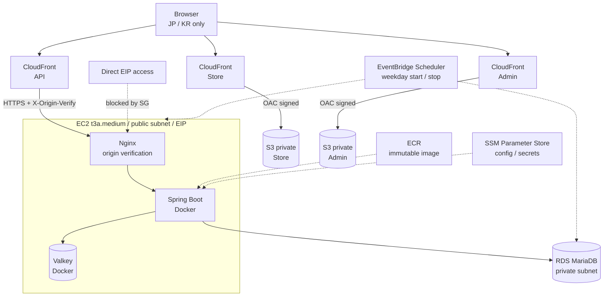
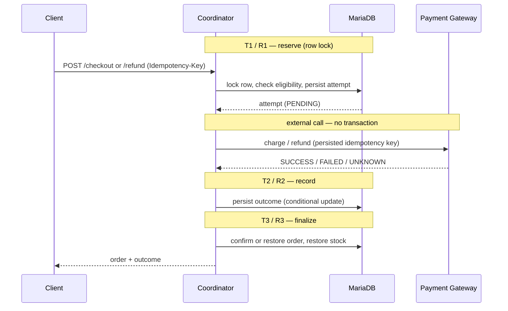
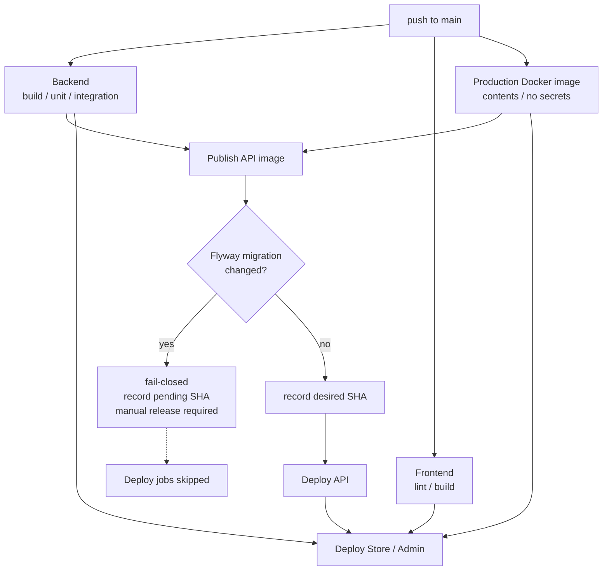

# EC Portfolio

[日本語](../README.md) | **한국어** | [English](README.en.md)

        

Kotlin / Spring Boot 와 React / TypeScript 로 만든 이커머스 포트폴리오입니다. 상품·장바구니·주문 CRUD 를 넘어, **결제와 환불처럼 실패할 수 있는 외부 호출을 어떻게 안전하게 설계하는가**를 주제로 삼았습니다. 결제 gateway 의 응답이 유실되면, 같은 요청이 두 번 도착하면, DB migration 이 포함된 릴리스를 자동 배포해도 되는가 — 이런 판단을 transaction 경계, idempotency, row lock, release guard 로 구현했습니다.

인프라는 Terraform 으로 관리하고 GitHub Actions 에서 OIDC 로 AWS 에 배포합니다. 개인 포트폴리오인 만큼 월 비용을 억제하기 위해 ALB 와 NAT Gateway 를 쓰지 않는 구성을 선택했습니다.

## Highlights

- **Transaction 경계를 분리한 checkout** — 외부 gateway 호출을 DB transaction 밖에 두고, 예약·결과 기록·확정을 독립된 transaction 으로 분리
- **환불 orchestration 과 복구** — 주문 행 lock 아래에서 "지금 유효한 refund attempt" 를 확인해, 오래된 attempt 의 replay 가 새 환불을 망가뜨리지 않도록 보호
- **Idempotency 와 동시성 제어** — idempotency key, request fingerprint, `SELECT ... FOR UPDATE`, 조건부 상태 전이로 재고 복원 중복 방지
- **Migration guard 기반 fail-closed 릴리스** — Flyway migration 이 포함된 변경은 자동 배포를 멈추고 수동 릴리스를 요구
- **frontend 선행 배포 방지** — migration guard 또는 online API 배포가 실패한 릴리스에서 frontend 만 backend 보다 먼저 나가는 것을 차단
- **Terraform 으로 구성한 AWS Demo 환경** — VPC, CloudFront, S3/OAC, EC2, RDS, ECR, Parameter Store, Scheduler 를 IaC 로 관리

## Demo

| | URL |
|---|---|
| Store | <https://d39sletn97e89c.cloudfront.net> |
| Admin | <https://d1ap338mlg8v7d.cloudfront.net> |
| API | <https://d1q0vfmnxby7vo.cloudfront.net> |

> **운영 시간**: 비용 최적화를 위해 Demo runtime 은 평일에만 기동합니다. RDS 는 09:50 기동 / 17:10 정지, EC2 는 10:00 기동 / 17:00 정지입니다(JST, `infra/terraform/demo/scheduler.tf`). API 를 쓸 수 있는 시간은 대략 평일 10:00~17:00 JST 이며 기동과 readiness 상황에 따라 다소 앞뒤로 움직입니다. Store / Admin 은 S3 + CloudFront 이므로 상시 조회할 수 있습니다.
>
> **릴리스 반영**: DB migration 이 포함된 릴리스는 안전 확인을 위해 수동 릴리스 대상이 되며, Demo 반영이 main 보다 늦어질 수 있습니다.

UI 기본 언어는 일본어이며, Store / Admin 모두 화면에서 일본어와 한국어를 전환할 수 있습니다.

## Architecture

### Current Demo Architecture



| Component | 역할 |
|---|---|
| CloudFront | Store / Admin / API 를 별도 distribution 으로 배포. TLS 종단, JP/KR geo restriction, API 는 `Idempotency-Key` 를 포함한 필요한 header 만 origin 으로 전달 |
| S3 | Store / Admin 정적 산출물을 private bucket 에 보관. public access 는 차단하고, 이용자에게 나가는 배포 경로는 CloudFront OAC 로 한정 |
| EC2 | 단일 인스턴스. Nginx 가 `X-Origin-Verify` 를 검증해 CloudFront 이외의 직접 접근을 차단. Spring Boot 와 Valkey 는 private Docker network 상의 컨테이너 |
| RDS | MariaDB 10.11, private subnet, 암호화, public access 비활성. 애플리케이션은 `sslMode=verify-full` 로 접속 |
| ECR | API 이미지를 full Git SHA 의 immutable tag 로 보관. `latest` 는 사용하지 않음 |
| Parameter Store | runtime 설정과 DB password / JWT secret 같은 SecureString. EC2 instance role 로 조회 |
| EventBridge Scheduler | 평일에만 EC2 / RDS 를 기동·정지해 유휴 시간의 compute 비용을 절감 |

### Why this architecture

- **ALB 와 NAT Gateway 를 쓰지 않음** — 트래픽이 낮은 Demo 에서는 고정비가 가치를 넘어서므로, EC2 를 public subnet 에 두고 EIP 와 Security Group 으로 통제하며 RDS 는 private subnet 에 유지합니다.
- **CloudFront 를 앞단에 배치** — TLS 종단, geo restriction, origin 은닉을 관리형으로 얻고, EC2 SG 는 CloudFront prefix list 만 허용합니다. SG 만으로는 경로를 강제할 수 없어 Nginx 가 공유 secret header 를 검증합니다.
- **immutable 릴리스 산출물** — image tag 는 full Git SHA 이며 `latest` 를 금지해, 실행 중인 이미지와 커밋이 항상 1:1 로 대응합니다.
- **secret 을 image 에 넣지 않음** — 설정은 runtime 환경변수로 주입하고 값은 Parameter Store 의 SecureString 에서 instance role 로 가져옵니다. CI 가 image 안에 secret 이 없음을 검증합니다.
- **desired state 기반 수렴** — 배포 대상 SHA 를 Parameter Store 에 기록하므로 EC2 가 정지 중이어도 배포가 실패하지 않고, 기동 시 systemd unit 이 수렴시킵니다.

### Planned Next Demo Architecture

다음 목표는 origin host 를 **교체 가능하고 정지 가능한 구성으로 만드는 것**입니다.

```
CloudFront → HTTPS origin (EIP) → ECS on EC2 Spot
                                    ├─ Spring Boot
                                    └─ Valkey sidecar
                                  → RDS (private)
```

NAT Gateway 를 쓰지 않는 비용 방침은 유지하면서, 단일 장수명 EC2 인스턴스에서 정지·교체를 전제로 한 task 기반 구성으로 옮기는 것이 목표입니다.

그 전제로 **origin TLS state 영속화**를 준비하고 있습니다. Let's Encrypt 인증서와 ACME account 를 private S3 에 tar 로 보관해, host 가 교체돼도 재발급 없이 복원하는 구조입니다. 부팅마다 발급하면 duplicate certificate rate limit 에 도달하기 때문입니다.

> ECS / Spot 의 Terraform 구현은 아직 저장소에 존재하지 않으며, 위 내용은 설계 방향입니다. ALB + ECS/Fargate + Multi-AZ 를 포함한 장기 production 참조 설계는 [aws-production.md](architecture/aws-production.md) 에 있습니다.

## Core Features

main branch 에 구현된 기능입니다.

| 영역 | Store | Admin |
|---|---|---|
| 인증 | 회원가입 / 로그인(JWT) | 관리자 로그인, `ROLE_ADMIN` 라우트 가드 |
| 상품 | 목록·상세, 키워드 검색, 가격대 필터, 정렬, 페이지네이션 | CRUD, 재고·공개 상태 관리 |
| 카테고리 | 필터링 | CRUD |
| 장바구니 | Valkey 에 보관. 추가 / 수량 변경 / 삭제 / 비우기 | — |
| Checkout | 장바구니에서 주문 생성 후 결제. 금액은 서버가 장바구니에서 산출 | — |
| 주문 | 목록 / 상세, 미결제 legacy 주문 취소 | 목록 / 상세, 서버 측 전이표에 따른 상태 변경 |
| Refund | 환불 요청, 미확정 환불의 재개(reconcile) | 고객이 시작한 환불을 포함한 처리와 reconcile |

## Backend Design Highlights

### Checkout 과 Refund 의 orchestration

결제 gateway 호출을 DB transaction 안에 두면 네트워크 대기 동안 lock 을 계속 붙잡게 됩니다. 그래서 외부 호출을 transaction 밖으로 빼고, 그 앞뒤를 독립된 transaction 으로 분할했습니다. 뒤에서 실패해도 앞에서 확정된 사실이 되돌려지지 않게 하기 위함입니다. 각 단계는 개별 Spring bean 으로 구현했습니다. 같은 클래스 안에서 호출하면 proxy 를 거치지 않아 `@Transactional` 경계가 사라지기 때문입니다.



### Idempotency, 동시성 제어, 복구

- **Idempotency key 와 request fingerprint** — 같은 key 로 재전송하면 원래 결과를 재생합니다. 같은 key 로 다른 내용(금액이나 대상 charge)이 오면 fail-closed 로 거부합니다.
- **Row lock** — 고객과 운영자가 같은 주문을 동시에 조작해도 동일한 주문 행의 lock 을 두고 경합하므로 환불은 하나만 시작됩니다.
- **오래된 attempt 보호** — 환불 확정 단계는 주문 행 lock 아래에서 "지금 유효한 attempt" 를 DB 에 묻습니다. 거부된 과거 attempt 가 replay 돼도 새 환불이 확보한 `REFUND_PENDING` 을 해제하지 않습니다.
- **재고 복원 중복 방지** — 재고를 되돌리는 것은 조건부 UPDATE 가 실제로 상태를 전이시킨 transaction 뿐입니다. 같은 처리를 재실행해도 재고가 늘지 않습니다.
- **미확정 처리** — gateway 가 결과를 돌려주지 않으면 주문을 취소하지도 해제하지도 않고 보류합니다. 환불이 확정되지 않았는데 재고를 되돌리는 것도, 이미 환불됐을 수 있는 주문을 다시 출하 가능 상태로 만드는 것도 피하기 위함입니다.
- **server-side reconcile** — client 가 idempotency key 를 잃어도 서버에 저장된 attempt 의 key 로 처리를 재개할 수 있습니다. 저장된 key 를 client 에 돌려주지도, 새 key 를 기존 attempt 에 묶지도 않습니다.
- **알려진 trade-off** — checkout 의 마지막 단계인 장바구니 정리는 best-effort 입니다. 결제·주문·재고가 확정된 뒤 장바구니 정리 전에 프로세스가 죽으면 이미 구매한 행이 장바구니에 남을 수 있습니다. transaction 경계를 의도적으로 나눈 결과이며, 재시도마다 장바구니를 다시 차감해 고객이 나중에 담은 항목까지 지우는 것보다 안전하다고 판단했습니다.

## Database & Migration Safety

- **Flyway forward migration** — down script 를 두지 않고 전진만으로 운영합니다.
- **불변 조건을 DB 제약으로 보장** — 주문 status 의 CHECK, 환불 완료 attempt 에는 provider 참조 ID 필수, 한 주문에 성공한 charge 는 한 건까지 같은 조건을 애플리케이션이 아니라 DB 에서 보장합니다.
- **기존 데이터가 있는 DB 의 upgrade 를 검증** — Testcontainers 로 실제 MariaDB 에 대해 migration 을 검증합니다. 빈 테이블에서는 데이터를 바꾸는 migration 의 순서 오류가 드러나지 않기 때문입니다.
- **DDL 은 1 statement 로 묶기** — MariaDB 는 DDL 을 롤백하지 않으므로, CHECK 제약 교체는 `DROP` 과 `ADD` 를 나누지 않고 단일 `ALTER TABLE` 로 수행합니다. 중간에 실패해 제약이 사라진 상태가 되는 것을 피하기 위함입니다.

## CI/CD & Release Safety



- **Production image 검증** — 실행 이미지에 JAR 외의 빌드 산출물이 남아 있지 않은지, RDS CA bundle 이 올바른 권한으로 존재하는지, 환경변수와 레이어 이력에 secret 이 없는지를 CI 가 확인합니다.
- **Migration guard** — 마지막으로 정상 가동한 릴리스와 이번 커밋 사이에 Flyway migration 파일이나 설정의 차이가 있으면 자동 배포를 멈춥니다. 해당 SHA 는 "보류 중인 migration 릴리스" 로 Parameter Store 에 기록되어 수동 릴리스의 입력이 됩니다.
- **3 개의 release state** — "배포해야 할 SHA", "마지막으로 정상 가동한 SHA", "migration 대기 SHA" 를 Parameter Store 로 관리합니다. 롤백 대상이 없는 릴리스는 publish 시점에 거부합니다.
- **desired state 로의 수렴** — EC2 가 정지 중이어도 배포 job 은 실패하지 않고 대상 SHA 를 기록하고 끝냅니다. 기동 시 systemd unit 이 그 SHA 로 수렴시킵니다.
- **frontend / backend 순서** — frontend 배포는 API 배포 성공을 전제로 합니다. migration guard 로 멈춘 릴리스나 online host 배포가 실패한 릴리스에서 frontend 만 앞서 나가면, 가동 중인 backend 에 없는 endpoint 를 호출하기 때문입니다. 다만 host 가 offline 이면 API 배포는 desired SHA 를 기록하고 정상 종료하므로 frontend 가 먼저 나갑니다. 이 경우 host 기동 후 backend 가 수렴할 때까지 일시적인 window 가 생깁니다.
- **short-lived credential** — GitHub Actions 는 OIDC 로 AWS role 을 assume 합니다. static access key 는 저장하지 않습니다.

## Security

| 영역 | 구현 |
|---|---|
| 인증 / 인가 | JWT. `/api/admin/**` 는 `ROLE_ADMIN`, 사용자는 자기 주문만 조작 가능 |
| 정보 노출 억제 | 타인 주문에 대한 조작은 "권한 없음" 이 아니라 "존재하지 않음" 으로 응답해 ID 실재를 추측하지 못하게 함 |
| DB 접속 | `sslMode=verify-full` 과 RDS Tokyo CA bundle. system trust store fallback 비활성 |
| Cache 접속 | Demo 에서는 Valkey 를 host 에 노출하지 않고 Spring Boot 와 같은 host 의 private Docker network 안에서만 접근합니다. 이 구성에서는 TLS 와 인증을 쓰지 않는 Demo 한정의 명시적 예외를 둡니다. production profile 에서는 Valkey TLS 와 username / password 를 강제합니다 |
| Secret | image 에 넣지 않고 Parameter Store 의 SecureString 에서 instance role 로 취득 |
| Container | multi-stage build, non-root 실행 |
| API 문서 | OpenAPI UI 는 production profile 에서 기본 비활성 |
| 네트워크 | RDS 는 private. EC2 직접 접근은 SG 로 차단하고 Nginx 가 origin header 검증 |
| AWS 인증 | GitHub OIDC 기반 단기 자격증명만 사용 |

## Tech Stack

| Layer | Technology |
|---|---|
| Backend | Kotlin 2.0, Spring Boot 3.5, Java 21 |
| Persistence | MariaDB 10.11, MyBatis, Flyway |
| Cache / Session | Valkey (Redis protocol) |
| Frontend | React 19, TypeScript, Vite, React Router, i18next |
| Infrastructure | AWS (CloudFront, S3, EC2, RDS, ECR, SSM, EventBridge), Terraform |
| CI/CD | GitHub Actions, GitHub OIDC |
| Runtime | Docker, Nginx |
| Testing | JUnit 5, Testcontainers, Vitest |

## Repository Structure

```
apps/api          Kotlin / Spring Boot API(domain / application / infra / presentation)
apps/store-web    Store frontend(React + TypeScript)
apps/admin-web    Admin frontend(React + TypeScript)
packages          workspace 공유 패키지(contracts / i18n / ui / config)
infra/terraform   AWS Demo 환경의 Terraform
infra/runtime     배포·수렴·호스트 설정 스크립트와 검증 스위트
docs              아키텍처 설계와 ADR
```

## Local Development

Docker Desktop 과 Node.js 22 가 필요합니다. backend 를 로컬에서 직접 기동할 때만 Java 21 을 사용합니다.

```zsh
git clone git@github.com:nagi4757/ec-portfolio.git
cd ec-portfolio
npm install
cp .env.example .env            # DB / JWT 등 로컬 값 설정

docker compose up -d            # API + MariaDB + Valkey
npm run dev:store               # Store
npm run dev:admin               # Admin
```

Flyway migration 은 기동 시 자동 적용됩니다. Java 21 로 backend 를 직접 기동하는 경우는 다음과 같습니다.

```zsh
cd apps/api
set -a && source ../../.env && set +a
./gradlew bootRun
```

배포와 운영 절차는 [infra/runtime/demo/README.md](../infra/runtime/demo/README.md), 인프라 구성은 [infra/terraform/demo/README.md](../infra/terraform/demo/README.md) 를 참고하세요.

## Testing

```zsh
cd apps/api
./gradlew test                  # unit
./gradlew integrationTest       # Testcontainers(MariaDB 와 Redis 7 기동)

npm run test  --workspace=store-web
npm run lint  --workspace=store-web
npm run build --workspace=store-web
```

`integrationTest` 에는 checkout / refund orchestration, 동시성, DB 제약, migration upgrade 검증이 포함됩니다. 배포 스크립트는 `infra/runtime/demo/*.test.sh` 에 자체 검증 스위트를 갖고 있으며 CI 에서 실행됩니다.

## Status & Roadmap

**Completed** — 인증·상품·카테고리·검색·장바구니·주문, Checkout 과 결제 orchestration, Refund orchestration 과 server-side reconcile, AWS Demo 환경의 Terraform 화, GitHub OIDC 기반 자동 배포, migration guard 와 release state 관리, 기동 시 수렴

**In Progress** — 교체 가능한 origin host 의 전제가 되는 origin TLS state 영속화 준비

**Planned**

- ECS on EC2 Spot 과 Valkey sidecar 로의 이행
- 실제 결제 provider adapter 도입. 현재는 mock gateway 이며, 동일 idempotency key replay 보장 또는 provider status lookup 중 하나를 도입 전에 확인해야 합니다

## Documentation

- [Demo AWS Architecture](architecture/aws-demo.md) — Demo 환경의 설계 의도, 네트워크 경계, 비용 산정
- [Production AWS Architecture](architecture/aws-production.md) — 프로덕션 상정 참조 설계
- [ADR-001](adr/ADR-001-cost-optimized-demo-aws.md) — Demo 에서 ALB / ECS / NAT Gateway 를 채택하지 않은 판단
- [Runtime deployment](../infra/runtime/demo/README.md) / [Terraform](../infra/terraform/demo/README.md) — 운영 절차와 인프라 구성
