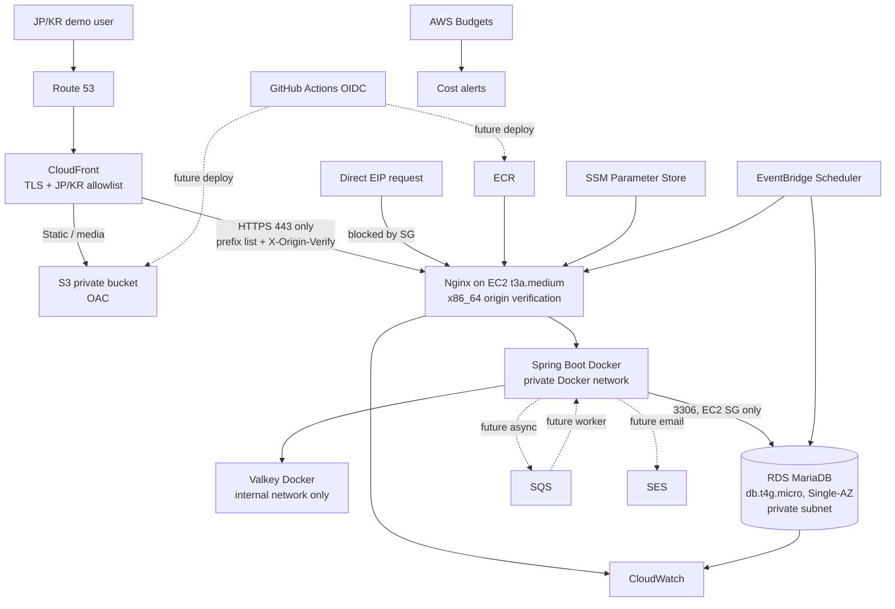

# Demo AWS Architecture

<!-- markdownlint-disable MD013 MD060 -->

## Purpose and constraints

이 문서는 EC Portfolio의 면접·포트폴리오 데모 환경을 위한 목표 아키텍처다. AWS 리소스를 실제로 생성하는 실행 계획이나 Terraform 명세가 아니다.

- Region: Asia Pacific (Tokyo), `ap-northeast-1`
- 운영 시간: 평일 22일 기준, RDS 09:50~17:10과 EC2 10:00~17:00 JST
- 월 비용 목표: ¥3,500~¥4,500
- 월 비용 상한: ¥5,000
- Free Tier와 promotional credit은 비용 성립 조건으로 사용하지 않는다.
- 단일 AZ와 예약된 downtime을 수용하는 demo 환경이다.

**¥5,000 이하는 24/7 운영 기준이 아니라 평일 제한 운영 Demo 기준이다.** EC2와 RDS를 24/7로 실행하면 contingency와 JCT를 포함해 약 ¥11,968/month로 증가해 hard ceiling을 초과한다.

관련 결정은 [ADR-001](../adr/ADR-001-cost-optimized-demo-aws.md), production 목표는 [Production AWS Architecture](aws-production.md)를 참조한다.

## Current application readiness

| 영역 | 현재 준비 상태 | Demo 배포 전 남은 작업 |
|---|---|---|
| API image | Java 21 multi-stage image, non-root runtime, `/actuator/health/liveness`와 `/actuator/health/readiness` 제공. 현재 CI build 결과는 단일 `linux/amd64` | ECR push와 EC2 runtime orchestration; ARM64는 별도 build/validation 필요 |
| Database | MariaDB/Flyway 사용, production profile에서 RDS Tokyo CA bundle과 `verify-full` 강제 | RDS endpoint와 credentials 주입 |
| Cache | Redis protocol 사용, production profile에서 TLS와 username/password 강제 | EC2 local Valkey에 TLS/ACL을 구성하거나 TLS sidecar를 검증해야 함 |
| Configuration | runtime 환경변수 기반이며 image layer에 DB/Redis/JWT secret을 넣지 않는 CI 검증 존재 | SSM Parameter Store 조회와 least-privilege instance role |
| Frontend | Store/Admin Vite production build를 CI에서 검증 | S3 배포, CloudFront cache policy와 SPA fallback |
| CI/CD | Backend, Frontend, production Docker image CI 존재 | GitHub OIDC trust와 deploy workflow는 아직 없음 |
| Messaging/email | 애플리케이션 연동 없음 | SQS/SES는 향후 비동기 알림 use case가 생길 때만 연결 |

현재 repository는 배포 가능한 구성 요소를 갖췄지만, 이 문서만으로 AWS 배포가 완료되는 것은 아니다. 특히 local Valkey의 production TLS/RBAC 계약은 배포 전에 검증해야 하는 명시적 gate다.

## Architecture

## Request and network boundaries

### CloudFront geo restriction

CloudFront country allowlist를 `JP`, `KR`로 제한한다. AWS 문서상 CloudFront geo restriction은 allowlist/blocklist를 지원하고 추가 설정 비용이 없다. 이는 공격 표면과 우발적 트래픽을 줄이는 보조 통제일 뿐 security boundary나 authentication/authorization이 아니다. VPN/proxy로 우회할 수 있으며 API 인증·인가와 rate limiting을 대체하지 않는다.

Source: [CloudFront geographic restrictions](https://docs.aws.amazon.com/AmazonCloudFront/latest/DeveloperGuide/DownloadDistValuesEnableGeoRestriction.html)

### Preventing EC2 origin bypass

EC2 origin은 다음 두 제어를 **모두 필수로** 적용한다.

1. EC2 origin security group은 `443/tcp` source를 AWS-managed `com.amazonaws.global.cloudfront.origin-facing` prefix list로만 허용한다. `0.0.0.0/0 → 443`과 `::/0 → 443`은 금지한다.
2. CloudFront custom origin은 `X-Origin-Verify: <high-entropy-secret>` header를 덮어써 전달한다. EC2의 Nginx는 header가 없거나 값이 다르면 Spring Boot로 proxy하지 않고 `403`을 반환한다.
3. CloudFront origin protocol policy는 HTTPS only이며 Nginx가 EC2의 `443/tcp`에서 유효한 certificate로 TLS를 종료한다.

Prefix list만 사용하면 다른 CloudFront distribution도 네트워크상 origin에 접근할 수 있다. Secret header만 사용하면 origin을 직접 스캔할 수 있다. 두 제어를 함께 사용해야 distribution과 network source를 동시에 제한할 수 있다. Origin secret은 SSM `SecureString`에 보관하고 로그에 기록하지 않으며 정기·노출 의심 시 교체한다.

CloudFront managed prefix list는 security group quota에서 weight 55를 소비한다. Origin security group은 `443` prefix-list rule과 필요한 최소 egress만 갖도록 단순하게 유지하고 불필요한 CIDR rule을 추가하지 않는다. 구현 전에 계정의 security group rule quota를 확인한다.

Sources:

- [AWS-managed prefix lists](https://docs.aws.amazon.com/vpc/latest/userguide/working-with-aws-managed-prefix-lists.html)
- [CloudFront custom origin headers](https://docs.aws.amazon.com/AmazonCloudFront/latest/DeveloperGuide/add-origin-custom-headers.html)

Viewer-to-CloudFront와 CloudFront-to-EC2 모두 HTTPS를 강제한다. 직접 EIP 요청은 source가 CloudFront origin-facing prefix list에 속하지 않아 security group에서 차단된다. 다른 CloudFront distribution을 통한 접근 가능성은 `X-Origin-Verify` 검증으로 차단한다. Prefix list 또는 origin header 하나만으로 충분하다고 간주하지 않는다.

### No NAT Gateway and no ALB

EC2는 NAT Gateway 비용을 제거하기 위해 public subnet에서 EIP를 사용하고, RDS는 public access를 끈 private subnet에 둔다. Public subnet 선택은 unrestricted public server를 의미하지 않는다. EC2의 ECR/SSM/SQS/SES outbound와 package/image pull은 Internet Gateway를 통하지만 inbound는 아래 contract로 제한한다.

- SSH `22/tcp` Internet ingress 없음; 운영 접속은 SSM Session Manager만 사용
- IMDSv2 required, hop limit 최소화, instance metadata tag access는 필요할 때만 허용
- EC2 `443/tcp`는 CloudFront origin-facing managed prefix list에서만 허용
- Spring Boot port와 Valkey `6379/tcp`를 host/EIP에 publish하지 않음
- RDS `3306/tcp`는 CIDR이 아니라 EC2 application security group reference만 source로 허용

ALB를 제거하면 fixed hourly cost와 복수 AZ target 운영 비용을 피할 수 있지만 managed health routing, connection draining과 target failover를 포기한다. CloudFront VPC Origin은 ALB뿐 아니라 private EC2도 지원하므로 기술적으로 불가능해서 제외하는 것이 아니다. Private EC2가 ECR pull, SSM, OS patch와 CloudWatch 전송을 하려면 NAT Gateway 또는 여러 VPC endpoint가 필요할 수 있고, 그 fixed cost와 운영 복잡성이 ¥5,000 constraint에 맞지 않아 protected public EC2를 의도적으로 선택한다. EC2가 중지되거나 장애가 나면 API는 unavailable이다.

Source: [CloudFront VPC origins](https://docs.aws.amazon.com/AmazonCloudFront/latest/DeveloperGuide/private-content-vpc-origins.html)

### Minimum L7 and DDoS controls without paid WAF

Demo는 paid AWS WAF와 Shield Advanced를 사용하지 않는다. 다음 controls를 최소 contract로 적용한다.

CloudFront:

- 모든 viewer traffic 앞에 배치하고 viewer HTTPS를 강제한다.
- 모든 AWS account에 기본 제공되는 Shield Standard network/transport-layer protection을 활용하되 WAF나 authentication의 대체로 간주하지 않는다.
- JP/KR geo allowlist로 불필요한 노출을 줄인다.
- Hashed static asset과 public media만 cache하고 versioned cache key와 bounded TTL을 사용한다.
- `/api/**`, 특히 login/auth/cart/order/admin API는 caching을 끄며 authorization/cookie가 포함된 response, `401`, `403`을 shared cache에 저장하지 않는다.

Nginx:

- API JSON request의 `client_max_body_size`를 1 MiB로 제한하고 media는 S3 presigned upload로 분리한다.
- Request line/header buffer를 기본보다 무제한 확장하지 않고 header 총량을 제한한다.
- `client_header_timeout`/`client_body_timeout` 10초, `proxy_connect_timeout` 3초, `proxy_read_timeout` 30초를 초기값으로 두고 load test로 조정한다.
- Origin 전체 concurrent connection limit과 CloudFront가 덮어쓰는 viewer-address key 기반의 보수적 request rate/burst limit을 둔다.
- 반복되는 malformed request, body overflow와 rate limit event를 body 없이 sampling logging하고 과도한 retry를 차단한다.

Application의 login/auth와 이후 payment 같은 민감 endpoint별 identity-aware rate limiting은 후속 Application Security task다. WAF가 없으므로 bot, cache-busting과 정교한 L7 abuse 방어는 제한적이라는 risk를 수용한다. Shield Standard는 WAF, rate limiting, authentication/authorization을 대체하지 않는다.

Sources:

- [AWS Shield Standard](https://aws.amazon.com/shield/features/)
- [CloudFront caching and cache keys](https://docs.aws.amazon.com/AmazonCloudFront/latest/DeveloperGuide/ConfiguringCaching.html)

## Runtime and schedules

### EC2

- `t3a.medium` Linux On-Demand, x86_64 AMD, 2 vCPU/4 GiB로 Spring Boot와 Valkey의 합산 memory headroom을 확보한다.
- EventBridge Scheduler가 평일 10:00에 start, 17:00에 stop한다. 하루 7시간, 22일 기준 월 154시간이다.
- 인터뷰나 특별 demo를 위한 수동 start는 허용하지만 schedule과 `AutoStop` tag를 변경하지 않는다. 17:00 이전 수동 기동은 같은 날 stop schedule을 적용하고, stop schedule 이후 기동은 승인된 수동 stop 시각과 담당자가 없으면 금지한다. 연장 시간은 contingency와 Budget으로 추적한다.
- stopped 상태에서는 compute가 과금되지 않지만 EBS와 Elastic IP는 계속 과금된다.
- 고정 CloudFront origin을 위해 EIP를 유지한다. 일반 public IPv4는 stop/start 시 변경된다.
- SSH `22/tcp`를 공개하지 않고 SSM Session Manager를 운영 경로로 사용한다.
- Instance metadata options에서 IMDSv2 token을 required로 설정한다.

AWS는 stopped EC2 compute에는 instance usage를 청구하지 않지만 EBS와 Elastic IP 같은 부속 리소스는 계속 과금한다고 설명한다.

Sources:

- [Amazon EC2 T3/T3a instances](https://aws.amazon.com/ec2/instance-types/t3/)
- [EC2 general purpose instance specifications](https://docs.aws.amazon.com/ec2/latest/instancetypes/gp.html)
- [EC2 instance types by Region](https://docs.aws.amazon.com/ec2/latest/instancetypes/ec2-instance-regions.html)
- [EC2 instance state and billing](https://docs.aws.amazon.com/AWSEC2/latest/UserGuide/ec2-instance-lifecycle.html)
- [EC2 public IP behavior](https://docs.aws.amazon.com/AWSEC2/latest/UserGuide/using-instance-addressing.html)

#### x86_64 selection and ARM64 future optimization

현재 production Docker CI는 GitHub `ubuntu-latest` runner의 기본 `docker build`만 사용하며 multi-platform `buildx`나 `linux/arm64` manifest validation이 없다. 따라서 현재 ECR image contract는 `linux/amd64`이고 Demo EC2도 x86_64를 사용한다.

| Candidate | Architecture | vCPU / memory | Tokyo On-Demand | Decision |
|---|---|---:|---:|---|
| `t3a.medium` | x86_64, AMD EPYC | 2 / 4 GiB | $0.0490/h | Selected |
| `t3.medium` | x86_64, Intel | 2 / 4 GiB | $0.0544/h | 약 10% 높아 제외 |

`t3a.medium`은 동일 vCPU/memory의 x86_64 후보 중 비용이 낮고 현재 amd64 image를 재빌드 없이 실행할 수 있어 선택한다. 측정 전 `t3a.small`로 낮추지 않으며, x86_64에서 Spring Boot + Nginx + Valkey의 memory/load를 실측한 뒤 별도 cost optimization으로만 검토한다.

Demo는 비용 예측성을 위해 명시적으로 `standard` CPU credit mode를 사용한다. T3a는 `standard`와 `unlimited`를 모두 지원하지만 기본값은 `unlimited`이므로 provisioning 단계에서 credit specification을 검증해야 한다. Standard는 accrued credit을 초과한 지속 부하에서 CPU가 baseline으로 점진적으로 제한되는 trade-off가 있다. `CPUCreditBalance`와 CPU utilization을 관찰하고 throttling이 demo 품질을 해치면 instance family/size와 runtime을 다시 산정한다. Unlimited 전환은 surplus credit 추가 비용을 산정해 contingency를 재승인한 뒤에만 허용한다.

CPU credit sources:

- [Configure burstable performance instances](https://docs.aws.amazon.com/AWSEC2/latest/UserGuide/burstable-performance-instances-how-to.html)
- [Standard mode for burstable performance instances](https://docs.aws.amazon.com/AWSEC2/latest/UserGuide/burstable-performance-instances-standard-mode.html)
- [Key concepts for burstable performance instances](https://docs.aws.amazon.com/AWSEC2/latest/UserGuide/burstable-credits-baseline-concepts.html)

ARM64/Graviton은 future optimization으로만 남긴다. 다음 gate가 모두 완료된 후 별도 review로 전환할 수 있다.

- `docker buildx` multi-platform build
- `linux/arm64` image와 ECR manifest/digest 제공
- CI에서 image architecture validation
- ARM64 runtime에서 production image smoke/readiness test
- dependency와 operational tooling의 ARM64 compatibility 확인

### RDS

- MariaDB `db.t4g.micro`, Single-AZ, gp3 20 GiB, public access disabled
- 평일 09:50 start, 17:10 stop. 하루 7시간 20분, 22일 기준 월 161시간 20분
- EC2보다 먼저 시작하고 나중에 멈춰 connection 실패와 비정상 종료를 줄인다.
- stopped 상태에서도 provisioned storage와 backup storage는 과금된다.
- RDS는 최대 7일 연속 정지만 허용하며 이후 자동 시작한다. 평일 스케줄은 주말 정지가 7일 미만이므로 정상 운영에서는 제한에 걸리지 않지만, 장기 휴일에는 재정지 schedule과 상태 alert가 필요하다.

Scheduler invocation failure는 Budget이 아니라 runtime control로 감시한다. 각 start/stop schedule은 15분 event age와 최대 3회 bounded retry를 사용하고, schedule group의 `InvocationDroppedCount >= 1`에 CloudWatch alarm을 둔다. 네 개의 단순 lifecycle API를 위한 SQS DLQ는 Demo 기본 구성에서 제외하며, 이로 인해 실패 payload forensic이 제한되는 risk를 수용한다. Budget은 누적 비용의 후행 guardrail이며 schedule 성공 여부를 대신하지 않는다. 종료 예정 시각 이후 actual-state mismatch 점검은 Phase 3B에 포함하지 않고 별도 operational enhancement로 재검토한다.

Source: [Stopping an Amazon RDS DB instance temporarily](https://docs.aws.amazon.com/AmazonRDS/latest/UserGuide/USER_StopInstance.html)

Automated backup은 retention 범위에서 사용하고, 실행 중인 DB instance의 provisioned storage와 같은 크기까지 제공되는 regional backup allowance 안에 머문다고 가정한다. Automated backup과 manual snapshot의 합계가 allowance를 초과하면 추가 backup storage 비용이 발생할 수 있다. Manual snapshot은 상시 유지하지 않으며, destructive migration 전에 snapshot이 필요하면 보존 기간과 초과 storage를 별도로 재평가한다. 이 변동 가능성은 아래 contingency에 포함한다.

Source: [Amazon RDS backup storage costs](https://aws.amazon.com/blogs/database/demystifying-amazon-rds-backup-storage-costs/)

## Storage, images, and delivery

### EC2-local Valkey data policy

- Valkey `6379/tcp`는 host port 또는 public interface에 publish하지 않고 전용 Docker internal network에만 연결한다.
- 해당 network에는 Spring Boot와 Valkey container만 참여하며 Nginx와 외부 client는 접근하지 않는다.
- Container memory limit과 reservation을 설정해 API memory를 침범하지 않게 한다. 초기 limit은 load test로 확정하며 EC2 4 GiB 전체를 사용하지 않는다.
- `maxmemory`를 limit보다 낮게 설정하고 cart workload에는 `allkeys-lru`를 기본 후보로 검증한다.
- Cart는 유실 가능한 ephemeral data이며 RDS의 order는 영구 business record다. 주문 생성 transaction이 완료된 뒤 cart를 비우며 order correctness를 Valkey persistence에 의존하지 않는다.

Demo는 **A: EC2 stop 시 Cart 유실 허용**을 선택한다. AOF/RDB와 별도 EBS volume을 사용하면 stop/start 보존 가능성이 높아지지만 persistence tuning, recovery test, write I/O와 stale-cart lifecycle이 추가된다. Portfolio demo에서는 명시적인 cart reset 안내와 단순한 failure model이 더 적절하다. Valkey persistence를 끄고 shutdown 시 cart가 사라질 수 있음을 UI/demo 운영 문서에 알린다. Cart durability가 requirement가 되면 임시 EBS persistence를 확장하기보다 Production의 ElastiCache와 data contract를 다시 설계한다.

### S3

- Store/Admin static assets와 media object를 분리된 prefix 또는 bucket으로 보관한다.
- Public Access Block을 켜고 CloudFront Origin Access Control만 허용한다.
- Versioning과 lifecycle은 복구 요구와 비용을 보고 선택하며 access log의 무기한 보관을 금지한다.
- API upload가 필요해지면 short-lived presigned URL을 사용해 EC2 bandwidth와 memory 사용을 줄인다.

Source: [Amazon S3 pricing](https://aws.amazon.com/s3/pricing/)

### ECR

- Production API image를 private ECR repository에 저장한다.
- immutable tag 또는 digest pinning을 사용하고 최근 release와 rollback image만 남기는 lifecycle policy를 둔다.
- EC2 instance role에는 필요한 repository pull 권한만, GitHub deploy role에는 push 권한만 부여한다.

Source: [Amazon ECR pricing](https://aws.amazon.com/ecr/pricing/)

### GitHub OIDC/CD direction

장기 access key를 GitHub secret에 저장하지 않는다. GitHub OIDC trust policy는 `aud = sts.amazonaws.com`을 요구하고 exact repository `nagi4757/ec-portfolio`를 조건에 포함한다. Subject는 `repo:nagi4757/ec-portfolio:ref:refs/heads/main` 또는 `repo:nagi4757/ec-portfolio:environment:<protected-environment>`만 허용하며 repository wildcard를 금지한다.

Role은 다음과 같이 분리한다.

- **GitHub Deploy Role:** ECR push, S3 deployment, 제한된 target/command의 SSM Run Command 등 배포 권한만 보유한다. Application DB/Valkey/JWT/origin secret을 읽을 수 없다.
- **EC2 Instance Role:** 필요한 ECR repository pull, application 전용 Parameter Store path/decrypt, CloudWatch Logs 전송, SSM Agent 권한만 보유한다.

목표 흐름은 다음과 같다.

1. CI 성공
2. API image를 full Git SHA immutable tag로 build/scan/ECR push하고 digest 기록
3. Frontend build, S3 sync, CloudFront invalidation 최소화
4. SSM Run Command 또는 제한된 deploy mechanism으로 EC2가 image digest를 pull
5. 새 container start 후 readiness check
6. 성공하면 stable image SHA/digest 갱신; 실패하면 previous stable digest로 container 재기동

`latest` tag를 deploy 또는 rollback 기준으로 사용하지 않는다. Deployed SHA/digest와 previous stable SHA/digest는 운영 record에 남긴다. Flyway migration은 Docker rollback과 함께 자동 rollback하지 않는다. Backward-compatible expand/migrate/contract migration을 기본으로 하고, destructive migration은 별도 승인, RDS snapshot/restore plan과 application compatibility 검증이 필요하다.

현재 workflow는 CI만 제공하며 이 CD 흐름은 향후 별도 review 대상이다.

Source: [IAM OIDC identity providers](https://docs.aws.amazon.com/IAM/latest/UserGuide/id_roles_providers_create_oidc.html)

## Configuration and secrets

Demo는 SSM Parameter Store Standard tier를 기본으로 한다.

- non-secret configuration: `String`
- DB credential, JWT secret, CloudFront origin verification secret, 필요 시 Valkey credential: `SecureString`
- default AWS-managed KMS key를 사용해 별도 customer-managed KMS key fixed cost를 피한다.
- EC2 instance role은 application path의 `GetParameter(s)`와 decrypt만 허용한다.

Parameter Store는 저비용·저빈도 demo configuration에 충분하지만 rotation engine, cross-account sharing, managed RDS rotation은 없다. Production에서 자동 rotation이나 별도 secret lifecycle이 필요하면 Secrets Manager로 승격한다.

CloudFront custom origin header 값을 향후 Terraform resource argument로 직접 넣으면 secret이 Terraform state에 존재할 수 있다. 이 문서는 Terraform을 구현하지 않으며, 구현 단계에서 state backend 접근 통제만으로 수용할지 out-of-band secret bootstrap/rotation을 사용할지 별도 ADR로 결정한다. GitHub Deploy Role이 bootstrap된 application secret을 읽는 방식은 사용하지 않는다.

Sources:

- [Systems Manager Parameter Store pricing](https://aws.amazon.com/systems-manager/pricing/)
- [Parameter Store tiers and comparison](https://docs.aws.amazon.com/systems-manager/latest/userguide/systems-manager-parameter-store.html)

## SQS and SES

SQS와 SES는 현재 application readiness가 아니며 즉시 생성할 필수 resource도 아니다. 주문 알림 같은 비동기 use case가 구현될 때 다음 경계로 도입한다.

- API transaction 완료 후 SQS standard queue에 idempotency key를 포함한 event 발행
- bounded retry와 DLQ 구성
- worker가 SES로 transactional email 발송
- SES sandbox 해제, identity verification, bounce/complaint handling은 별도 operational gate
- dedicated IP, Mail Manager, deliverability add-on은 demo에서 제외

Sources:

- [Amazon SQS pricing](https://aws.amazon.com/sqs/pricing/)
- [Amazon SES pricing](https://aws.amazon.com/ses/pricing/)

## Observability and cost controls

- Application log retention은 7일이며 `Never expire`를 금지한다.
- 기본 log level은 INFO이고 정상 health check access log는 억제한다.
- 기본 EC2/RDS metrics와 application error/availability, scheduler failure/state mismatch alarm만 사용한다.
- Container Insights, high-resolution/high-cardinality custom metric과 상시 전체 VPC Flow Logs는 사용하지 않는다.
- Request/response body, JWT, Authorization header, password, parameter/secret value를 기록하지 않는다.
- Alarm은 availability, error, schedule failure, unexpected running과 budget에 필요한 최소 수로 제한한다.

이는 CloudWatch 자체가 demo의 큰 비용원이 되지 않도록 하는 의도적인 Architecture Decision이다. 장애 조사 기간에만 sampling/retention을 제한적으로 높이고 종료 조건을 둔다.

AWS Budget은 account 전체를 감시하는 action 없는 `27.55 USD` monthly cost budget에 네 notification threshold를 둔다. `UnblendedCost`와 tax를 포함하되 credit/refund는 제외하여 promotional credit가 실제 resource burn을 숨기지 않게 한다.

| Threshold | 의미 | 대응 |
|---:|---|---|
| Actual 70% (약 ¥3,500) | Warning | Cost Explorer에서 service별 증가 확인 |
| Actual 90% (약 ¥4,500) | Critical | EC2/RDS schedule과 log ingestion 즉시 확인, 비필수 demo 중지 |
| Forecasted 90% | Early critical | Forecast 근거와 runtime 연장 여부를 사전 확인 |
| Actual 100% (약 ¥5,000) | Strong alert | Hard budget 위반으로 간주, owner 확인 후 비용 발생 resource 중지/격리 |

`27.55 USD`는 stress exchange rate ¥165/USD와 JCT 10%에서 약 ¥4,999.58이다. Forecast는 충분한 usage history가 없으면 생성되지 않을 수 있으므로 Actual 알림을 기본 guardrail로 사용한다. FX와 세금 가정은 정기적으로 재검토한다.

AWS Budget alert는 지출을 자동으로 차단하는 hard cap이 아니다. Monitoring budget은 무료이며 action-enabled budget을 사용한다면 공식 가격과 quota를 다시 확인한다. Budget alert는 누적 actual/forecast cost를 감시하고, Scheduler bounded retry와 `InvocationDroppedCount` alarm은 runtime 호출 실패를 감시한다. 두 통제는 서로 대체하지 않는다.

## Cost allocation tags

향후 Terraform 단계에서 지원되는 모든 resource에 다음 공통 tag를 적용한다.

| Tag | Example | Purpose |
|---|---|---|
| `Project` | `ec-portfolio` | 비용과 resource ownership 집계 |
| `Environment` | `demo` | Demo/production 분리 |
| `Owner` | repository owner/team | 운영 책임자 식별 |
| `AutoStop` | `true` 또는 `false` | Schedule 적용 대상 명시 |

Tag가 없는 resource는 deployment review에서 예외 사유를 요구한다. Tag는 access control이나 scheduler 대상 검증을 보조하지만 resource state 자체를 신뢰하는 유일한 근거로 사용하지 않는다.

Sources:

- [Amazon CloudWatch pricing](https://aws.amazon.com/cloudwatch/pricing/)
- [AWS Budgets pricing](https://aws.amazon.com/aws-cost-management/aws-budgets/pricing/)

## Monthly cost estimate

### Assumptions

- Price snapshot: 2026-08-28
- Region: Tokyo, Linux On-Demand, Single-AZ
- EC2: 22 weekdays × 7 h = 154 h; RDS: 22 weekdays × 7 h 20 m = 161 h 20 m; month = 730 h
- Planning exchange rate: USD 1 = JPY 160; stress rate = JPY 165
- Japan Consumption Tax (JCT): 10%; AWS website prices are tax-exclusive
- Traffic: CloudFront 5 GB out/100k requests, S3 5 GB, ECR 1 GB, SQS 100k requests, SES 500 recipients, CloudWatch Logs 0.5 GB ingestion
- Free Tier와 promotional credit의 절감액은 계산에 반영하지 않음
- Domain registration fee는 아직 domain을 구매하지 않으므로 제외; Route 53 hosted zone은 포함

| Cost item | Usage/rate assumption | USD/month |
|---|---:|---:|
| EC2 compute | `t3a.medium` Standard, $0.0490/h × 154 h | $7.55 |
| EBS | gp3 20 GiB × $0.096/GiB-month | $1.92 |
| Public IPv4 | 1 EIP × $0.005/h × 730 h | $3.65 |
| RDS compute | `db.t4g.micro`, $0.026/h × 161 h 20 m | $4.19 |
| RDS storage | gp3 20 GiB × $0.138/GiB-month | $2.76 |
| CloudFront | Low traffic planning allowance | $1.00 |
| S3 | 5 GB plus low request volume | $0.14 |
| ECR | 1 GB image storage | $0.10 |
| SQS | 100k standard requests, no free allowance credited | $0.04 |
| SES | 500 recipients at current low-volume rate allowance | $0.08 |
| CloudWatch | 0.5 GB logs plus short retention allowance | $1.00 |
| Route 53 | 1 hosted zone plus low query volume | $0.54 |
| SSM Parameter Store | Standard tier plus low KMS request allowance | $0.01 |
| EventBridge Scheduler | Four weekday schedules, conservative allowance | $0.01 |
| AWS Budgets | Monitoring budget | $0.00 |
| **Base AWS pre-tax cost** | Exact calculation before row rounding | **$22.99** |
| **Variable contingency** | CloudWatch, CloudFront/S3, ECR, RDS backup, runtime and SES/SQS variance | **$2.00** |
| **AWS pre-tax subtotal** | Base + contingency | **$24.99** |

Cost contract는 exact USD 산식 후 invoice 단위로 반올림한다.

| Scenario | USD subtotal | FX | JPY pre-tax | JCT 10% | Estimated invoice | ¥5,000 buffer |
|---|---:|---:|---:|---:|---:|---:|
| Normal plan | $24.9907 | ¥160/USD | ¥3,998.51 | ¥399.85 | **¥4,398.36** | **¥601.64** |
| FX stress | $24.9907 | ¥165/USD | ¥4,123.46 | ¥412.35 | **¥4,535.81** | **¥464.19** |

$2.00 contingency는 CloudWatch log/metric 증가, CloudFront/S3 request·transfer, ECR image 증가, RDS backup/snapshot allowance 초과, 수동 runtime 연장, SES/SQS 증가를 흡수하는 conservative allowance다. Standard mode에서는 surplus CPU credit charge가 없으며, Unlimited 전환 시 예상 credit 비용을 이 allowance에 추가해 재계산한다. 이는 숫자를 맞추기 위한 할인 항목이 아니며 실제 비용 변동을 위해 base 위에 더한 금액이다. Normal planned invoice는 목표 ¥4,200~¥4,500 안이고 stress에서도 hard ceiling 아래다. Free Tier나 credit은 차감하지 않는다.

같은 EC2/RDS를 730시간 실행하면 compute만 EC2 약 $35.77, RDS 약 $18.98이 된다. 나머지 base 가정을 유지하면 $66.00이고, $2 contingency, ¥160/USD와 JCT 10%를 적용한 24/7 invoice는 약 ¥11,968로 ¥5,000을 크게 초과한다. 따라서 hard ceiling은 scheduled Demo contract에 종속된다.

단가는 시점, region, usage tier, 세금과 환율에 따라 변한다. 실제 생성 직전 AWS Pricing Calculator와 각 pricing page에서 다시 검증한다.

Primary pricing references:

- [EC2 On-Demand pricing](https://aws.amazon.com/ec2/pricing/on-demand/)
- [EBS pricing](https://aws.amazon.com/ebs/pricing/)
- [VPC public IPv4 pricing](https://aws.amazon.com/vpc/pricing/)
- [RDS for MariaDB pricing](https://aws.amazon.com/rds/mariadb/pricing/)
- [CloudFront pricing](https://aws.amazon.com/cloudfront/pricing/)
- [Route 53 pricing](https://aws.amazon.com/route53/pricing/)
- [EventBridge pricing](https://aws.amazon.com/eventbridge/pricing/)
- [AWS Tax Help: Japan](https://aws.amazon.com/tax-help/japan/)

## Operational gates

Resource implementation 전에 다음을 다시 review한다.

- AWS Pricing Calculator estimate가 ¥5,000 미만인지
- EC2 x86_64 image compatibility와 combined memory load test
- local Valkey TLS/ACL이 production profile과 호환되는지
- RDS TLS hostname verification과 private security group path
- CloudFront prefix list weight와 security group quota
- origin secret rejection test와 secret rotation procedure
- EC2/RDS start-stop schedule, holiday behavior, failure notification
- backup retention과 restore test
- S3 OAC, Public Access Block, CORS, SPA fallback
- OIDC trust가 repository/environment/ref로 제한되는지
