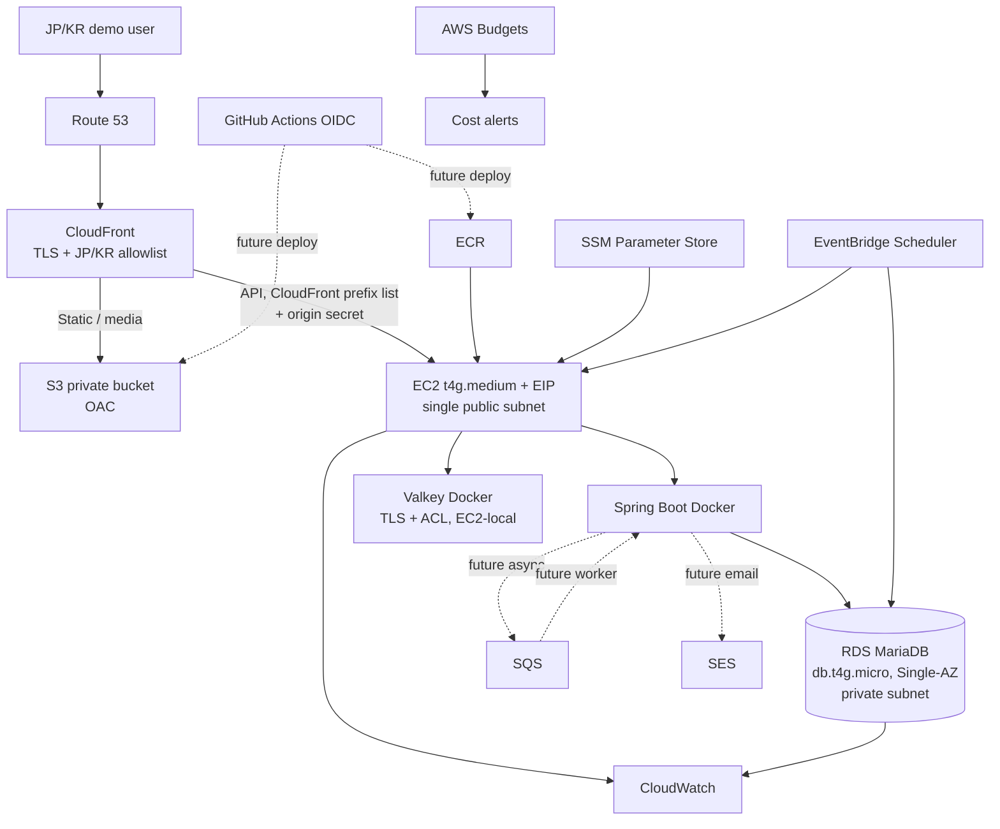

# Demo AWS Architecture

<!-- markdownlint-disable MD013 MD060 -->

## Purpose and constraints

이 문서는 EC Portfolio의 면접·포트폴리오 데모 환경을 위한 목표 아키텍처다. AWS 리소스를 실제로 생성하는 실행 계획이나 Terraform 명세가 아니다.

- Region: Asia Pacific (Tokyo), `ap-northeast-1`
- 운영 시간: 평일 09:00~19:00 JST, 월 220시간 가정
- 월 비용 목표: ¥3,500~¥4,500
- 월 비용 상한: ¥5,000
- Free Tier와 promotional credit은 비용 성립 조건으로 사용하지 않는다.
- 단일 AZ와 예약된 downtime을 수용하는 demo 환경이다.

관련 결정은 [ADR-001](../adr/ADR-001-cost-optimized-demo-aws.md), production 목표는 [Production AWS Architecture](aws-production.md)를 참조한다.

## Current application readiness

| 영역 | 현재 준비 상태 | Demo 배포 전 남은 작업 |
|---|---|---|
| API image | Java 21 multi-stage image, non-root runtime, `/actuator/health/liveness`와 `/actuator/health/readiness` 제공 | ECR push와 EC2 runtime orchestration |
| Database | MariaDB/Flyway 사용, production profile에서 RDS Tokyo CA bundle과 `verify-full` 강제 | RDS endpoint와 credentials 주입 |
| Cache | Redis protocol 사용, production profile에서 TLS와 username/password 강제 | EC2 local Valkey에 TLS/ACL을 구성하거나 TLS sidecar를 검증해야 함 |
| Configuration | runtime 환경변수 기반이며 image layer에 DB/Redis/JWT secret을 넣지 않는 CI 검증 존재 | SSM Parameter Store 조회와 least-privilege instance role |
| Frontend | Store/Admin Vite production build를 CI에서 검증 | S3 배포, CloudFront cache policy와 SPA fallback |
| CI/CD | Backend, Frontend, production Docker image CI 존재 | GitHub OIDC trust와 deploy workflow는 아직 없음 |
| Messaging/email | 애플리케이션 연동 없음 | SQS/SES는 향후 비동기 알림 use case가 생길 때만 연결 |

현재 repository는 배포 가능한 구성 요소를 갖췄지만, 이 문서만으로 AWS 배포가 완료되는 것은 아니다. 특히 local Valkey의 production TLS/RBAC 계약은 배포 전에 검증해야 하는 명시적 gate다.

## Architecture

## Request and network boundaries

### CloudFront geo restriction

CloudFront country allowlist를 `JP`, `KR`로 제한한다. AWS 문서상 CloudFront geo restriction은 allowlist/blocklist를 지원하고 추가 설정 비용이 없다. 이는 demo의 노출 면과 우발적 트래픽을 줄이지만 VPN, proxy, 탈취된 credential을 막는 인증 수단은 아니다. API 인증·인가와 rate limiting을 대체하지 않는다.

Source: [CloudFront geographic restrictions](https://docs.aws.amazon.com/AmazonCloudFront/latest/DeveloperGuide/DownloadDistValuesEnableGeoRestriction.html)

### Preventing EC2 origin bypass

EC2 origin은 다음 두 제어를 동시에 적용한다.

1. EC2 security group의 application ingress source를 AWS-managed `com.amazonaws.global.cloudfront.origin-facing` prefix list로 제한한다.
2. CloudFront가 high-entropy custom origin header를 덮어써 전달하고, EC2 origin이 일치하지 않는 요청을 API 도달 전에 거부한다.

Prefix list만 사용하면 다른 CloudFront distribution도 네트워크상 origin에 접근할 수 있다. Secret header만 사용하면 origin을 직접 스캔할 수 있다. 두 제어를 함께 사용해야 distribution과 network source를 동시에 제한할 수 있다. Origin secret은 SSM `SecureString`에 보관하고 로그에 기록하지 않으며 정기·노출 의심 시 교체한다.

CloudFront managed prefix list는 security group quota에서 weight 55를 소비하므로 전용 origin security group을 사용하고 남은 rule quota를 확인한다.

Sources:

- [AWS-managed prefix lists](https://docs.aws.amazon.com/vpc/latest/userguide/working-with-aws-managed-prefix-lists.html)
- [CloudFront custom origin headers](https://docs.aws.amazon.com/AmazonCloudFront/latest/DeveloperGuide/add-origin-custom-headers.html)

Viewer-to-CloudFront는 HTTPS를 강제한다. 비용 우선 demo에서 CloudFront-to-EC2는 public custom origin이라는 trade-off가 있다. Origin HTTPS와 certificate lifecycle을 안정적으로 운영할 수 없다면 prefix list와 secret header를 적용한 HTTP origin으로 시작할 수 있지만, 이 구간의 end-to-end TLS 부재를 production 수준 보안으로 표현해서는 안 된다. Production은 private origin과 TLS를 사용한다.

### No NAT Gateway and no ALB

EC2는 public subnet에서 EIP를 사용하고, RDS는 public access를 끈 private subnet에 둔다. 따라서 EC2의 ECR/SSM/SQS/SES outbound와 package/image pull은 Internet Gateway를 통하며 NAT Gateway는 없다. EC2 inbound는 CloudFront origin-facing prefix list로 제한하고 SSH는 열지 않으며 Session Manager를 사용한다.

ALB를 제거하면 fixed hourly cost와 복수 AZ target 운영 비용을 피할 수 있지만, managed health routing, connection draining, target failover, private CloudFront VPC origin을 포기한다. EC2가 중지되거나 장애가 나면 API는 unavailable이다. 이 선택은 demo downtime을 허용할 때만 유효하다.

## Runtime and schedules

### EC2

- `t4g.medium` Linux On-Demand, 2 vCPU/4 GiB로 Spring Boot와 Valkey의 합산 memory headroom을 확보한다.
- EventBridge Scheduler가 평일 08:50에 start, 19:10에 stop하여 bootstrap과 graceful shutdown 여유를 둔다.
- stopped 상태에서는 compute가 과금되지 않지만 EBS와 Elastic IP는 계속 과금된다.
- 고정 CloudFront origin을 위해 EIP를 유지한다. 일반 public IPv4는 stop/start 시 변경된다.
- SSH `22/tcp`를 공개하지 않고 SSM Session Manager를 운영 경로로 사용한다.

AWS는 stopped EC2 compute에는 instance usage를 청구하지 않지만 EBS와 Elastic IP 같은 부속 리소스는 계속 과금한다고 설명한다.

Sources:

- [EC2 instance state and billing](https://docs.aws.amazon.com/AWSEC2/latest/UserGuide/ec2-instance-lifecycle.html)
- [EC2 public IP behavior](https://docs.aws.amazon.com/AWSEC2/latest/UserGuide/using-instance-addressing.html)

### RDS

- MariaDB `db.t4g.micro`, Single-AZ, gp3 20 GiB, public access disabled
- 평일 08:45 start, 19:15 stop
- EC2보다 먼저 시작하고 나중에 멈춰 connection 실패와 비정상 종료를 줄인다.
- stopped 상태에서도 provisioned storage와 backup storage는 과금된다.
- RDS는 최대 7일 연속 정지만 허용하며 이후 자동 시작한다. 평일 스케줄은 주말 정지가 7일 미만이므로 정상 운영에서는 제한에 걸리지 않지만, 장기 휴일에는 재정지 schedule과 상태 alert가 필요하다.

Source: [Stopping an Amazon RDS DB instance temporarily](https://docs.aws.amazon.com/AmazonRDS/latest/UserGuide/USER_StopInstance.html)

## Storage, images, and delivery

### S3

- Store/Admin static assets와 media object를 분리된 prefix 또는 bucket으로 보관한다.
- Public Access Block을 켜고 CloudFront Origin Access Control만 허용한다.
- Versioning과 lifecycle은 복구 요구와 비용을 보고 선택하며 access log의 무기한 보관을 금지한다.
- API upload가 필요해지면 short-lived presigned URL을 사용해 EC2 bandwidth와 memory 사용을 줄인다.

Source: [Amazon S3 pricing](https://aws.amazon.com/s3/pricing/)

### ECR

- Production API image를 private ECR repository에 저장한다.
- immutable tag 또는 digest pinning을 사용하고 최근 release와 rollback image만 남기는 lifecycle policy를 둔다.
- EC2 instance role에는 필요한 repository pull 권한만, GitHub deploy role에는 push 권한만 부여한다.

Source: [Amazon ECR pricing](https://aws.amazon.com/ecr/pricing/)

### GitHub OIDC/CD direction

장기 access key를 GitHub secret에 저장하지 않는다. GitHub OIDC subject를 repository, branch 또는 protected environment에 제한한 IAM role로 단기 STS credential을 발급한다. 목표 흐름은 다음과 같다.

1. CI 성공
2. API image build, scan, ECR push
3. Frontend build, S3 sync, CloudFront invalidation 최소화
4. SSM Run Command 또는 제한된 deploy mechanism으로 EC2가 image digest를 pull하고 health check 후 전환

현재 workflow는 CI만 제공하며 이 CD 흐름은 향후 별도 review 대상이다.

Source: [IAM OIDC identity providers](https://docs.aws.amazon.com/IAM/latest/UserGuide/id_roles_providers_create_oidc.html)

## Configuration and secrets

Demo는 SSM Parameter Store Standard tier를 기본으로 한다.

- non-secret configuration: `String`
- DB/Valkey/JWT/origin secret: `SecureString`
- default AWS-managed KMS key를 사용해 별도 customer-managed KMS key fixed cost를 피한다.
- EC2 instance role은 application path의 `GetParameter(s)`와 decrypt만 허용한다.

Parameter Store는 저비용·저빈도 demo configuration에 충분하지만 rotation engine, cross-account sharing, managed RDS rotation은 없다. Production에서 자동 rotation이나 별도 secret lifecycle이 필요하면 Secrets Manager로 승격한다.

Sources:

- [Systems Manager Parameter Store pricing](https://aws.amazon.com/systems-manager/pricing/)
- [Parameter Store tiers and comparison](https://docs.aws.amazon.com/systems-manager/latest/userguide/systems-manager-parameter-store.html)

## SQS and SES

SQS와 SES는 현재 application readiness가 아니며 즉시 생성할 필수 resource도 아니다. 주문 알림 같은 비동기 use case가 구현될 때 다음 경계로 도입한다.

- API transaction 완료 후 SQS standard queue에 idempotency key를 포함한 event 발행
- bounded retry와 DLQ 구성
- worker가 SES로 transactional email 발송
- SES sandbox 해제, identity verification, bounce/complaint handling은 별도 operational gate
- dedicated IP, Mail Manager, deliverability add-on은 demo에서 제외

Sources:

- [Amazon SQS pricing](https://aws.amazon.com/sqs/pricing/)
- [Amazon SES pricing](https://aws.amazon.com/ses/pricing/)

## Observability and cost controls

- CloudWatch log group retention: application 14일, deployment/audit 성격 log 30일. `Never expire` 금지
- 기본 EC2/RDS metrics와 application error/availability alarm만 사용
- Container Insights, detailed monitoring, high-cardinality custom metrics는 demo에서 제외
- 로그에 token, authorization header, password, parameter value를 남기지 않음
- EventBridge Scheduler 실패와 RDS 자동 재시작 가능성을 alarm 대상으로 둠

AWS Budget은 하나의 monthly cost budget에 세 notification threshold를 둔다.

| Threshold | 의미 | 대응 |
|---:|---|---|
| ¥3,500 | Warning | Cost Explorer에서 service별 증가 확인 |
| ¥4,500 | Critical | EC2/RDS schedule과 log ingestion 즉시 확인, 비필수 demo 중지 |
| ¥5,000 | Strong alert | Hard budget 위반으로 간주, owner 확인 후 비용 발생 resource 중지/격리 |

AWS Budget alert는 지출을 자동으로 차단하는 hard cap이 아니다. Monitoring budget은 무료이며 action-enabled budget을 사용한다면 공식 가격과 quota를 다시 확인한다.

Sources:

- [Amazon CloudWatch pricing](https://aws.amazon.com/cloudwatch/pricing/)
- [AWS Budgets pricing](https://aws.amazon.com/aws-cost-management/aws-budgets/pricing/)

## Monthly cost estimate

### Assumptions

- Price snapshot: 2026-08-27
- Region: Tokyo, Linux On-Demand, Single-AZ
- 22 weekdays × 10 hours = 220 running hours; month = 730 hours
- Planning exchange rate: USD 1 = JPY 150; 실제 AWS 청구 환율·세금과 다를 수 있음
- Traffic: CloudFront 5 GB out/100k requests, S3 5 GB, ECR 1 GB, SQS 100k requests, SES 500 recipients, CloudWatch Logs 0.5 GB ingestion
- Free Tier와 promotional credit의 절감액은 계산에 반영하지 않음
- Domain registration fee는 아직 domain을 구매하지 않으므로 제외; Route 53 hosted zone은 포함

| Cost item | Usage/rate assumption | USD/month | JPY/month |
|---|---:|---:|---:|
| EC2 compute | `t4g.medium`, $0.0432/h × 220 h | $9.50 | ¥1,426 |
| EBS | gp3 20 GiB × $0.096/GiB-month | $1.92 | ¥288 |
| Public IPv4 | 1 EIP × $0.005/h × 730 h | $3.65 | ¥548 |
| RDS compute | `db.t4g.micro`, approx. $0.026/h × 220 h | $5.72 | ¥858 |
| RDS storage | gp3 20 GiB × approx. $0.138/GiB-month | $2.76 | ¥414 |
| CloudFront | Low traffic planning allowance | $1.00 | ¥150 |
| S3 | 5 GB plus low request volume | $0.14 | ¥21 |
| ECR | 1 GB image storage | $0.10 | ¥15 |
| SQS | 100k standard requests, no free allowance credited | $0.04 | ¥6 |
| SES | 500 recipients at current low-volume rate allowance | $0.08 | ¥12 |
| CloudWatch | 0.5 GB logs plus short retention allowance | $1.00 | ¥150 |
| Route 53 | 1 hosted zone plus low query volume | $0.54 | ¥81 |
| SSM Parameter Store | Standard tier plus low KMS request allowance | $0.01 | ¥2 |
| EventBridge Scheduler | Four weekday schedules, conservative allowance | $0.01 | ¥2 |
| AWS Budgets | Monitoring budget | $0.00 | ¥0 |
| **Estimated total** | | **$26.47** | **¥3,973** |

¥5,000은 계획 환율로 약 $33.33이며, 현재 estimate 대비 약 ¥1,027의 여유가 있다. 이 여유는 tax, 환율, CPU credit, backup, log burst, cache miss, data transfer와 잘못된 schedule을 위한 buffer다. CloudFront와 일부 service가 recurring free allowance 안에 들더라도 estimate를 낮추는 근거로 사용하지 않는다.

단가는 시점, region, usage tier, 세금과 환율에 따라 변한다. 실제 생성 직전 AWS Pricing Calculator와 각 pricing page에서 다시 검증한다.

Primary pricing references:

- [EC2 On-Demand pricing](https://aws.amazon.com/ec2/pricing/on-demand/)
- [EBS pricing](https://aws.amazon.com/ebs/pricing/)
- [VPC public IPv4 pricing](https://aws.amazon.com/vpc/pricing/)
- [RDS for MariaDB pricing](https://aws.amazon.com/rds/mariadb/pricing/)
- [CloudFront pricing](https://aws.amazon.com/cloudfront/pricing/)
- [Route 53 pricing](https://aws.amazon.com/route53/pricing/)
- [EventBridge pricing](https://aws.amazon.com/eventbridge/pricing/)

## Operational gates

Resource implementation 전에 다음을 다시 review한다.

- AWS Pricing Calculator estimate가 ¥5,000 미만인지
- EC2 ARM64 image compatibility와 combined memory load test
- local Valkey TLS/ACL이 production profile과 호환되는지
- RDS TLS hostname verification과 private security group path
- CloudFront prefix list weight와 security group quota
- origin secret rejection test와 secret rotation procedure
- EC2/RDS start-stop schedule, holiday behavior, failure notification
- backup retention과 restore test
- S3 OAC, Public Access Block, CORS, SPA fallback
- OIDC trust가 repository/environment/ref로 제한되는지
