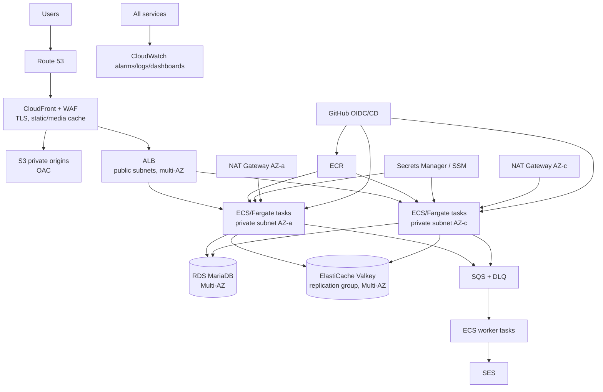

# Production AWS Architecture

<!-- markdownlint-disable MD013 MD060 -->

## Scope

이 문서는 비용 최적화 demo가 서비스 운영 요구를 갖게 되었을 때의 목표 architecture를 설명한다. 현재 구현이나 즉시 생성할 resource 목록이 아니다. Demo 결정은 [Demo AWS Architecture](aws-demo.md)와 [ADR-001](../adr/ADR-001-cost-optimized-demo-aws.md)을 참조한다.

## Target architecture

## Production properties

- 최소 2개 AZ에 stateless API task를 분산한다.
- ALB health check, deregistration delay와 rolling deployment로 단일 instance downtime을 제거한다.
- RDS Multi-AZ, backup/PITR, deletion protection과 restore rehearsal을 사용한다.
- ElastiCache Valkey replication group에 TLS, RBAC, automatic failover를 적용한다.
- Private subnet workload의 controlled outbound를 위해 AZ별 NAT Gateway 또는 검토된 VPC endpoint 조합을 사용한다.
- CloudFront, WAF managed rules, rate-based rules와 ALB origin protection을 적용한다.
- S3는 OAC와 Public Access Block을 유지하고 media lifecycle/replication은 RPO 요구로 결정한다.
- Secrets Manager는 rotation이 필요한 DB credential에, SSM Parameter Store는 non-secret configuration에 사용한다.
- SQS/DLQ와 idempotent worker로 email 및 외부 side effect를 request transaction에서 분리한다.
- autoscaling은 request/CPU/memory/queue depth 지표와 검증된 min/max capacity를 사용한다.

## Demo versus production

| Concern | Demo | Production |
|---|---|---|
| Availability | Scheduled, single EC2/Single-AZ RDS | Always-on, multi-AZ |
| Compute | EC2에 API와 Valkey co-located | ECS/Fargate API/worker 분리 |
| Entry point | CloudFront → EC2 EIP | CloudFront/WAF → ALB |
| Origin network | Public subnet, prefix list + secret | Private workload path and managed load balancing |
| Cache | EC2-local Valkey, cache loss 허용 | ElastiCache Valkey Multi-AZ |
| Database | RDS Single-AZ, scheduled stop | RDS Multi-AZ, PITR/restore drill |
| Outbound | Internet Gateway, no NAT | Private subnet, NAT/VPC endpoints |
| Scaling | Vertical/manual | Horizontal autoscaling |
| Deployment | Future SSM-based host deploy | ECS rolling/blue-green strategy |
| Secrets | SSM Standard/SecureString | Secrets Manager rotation + SSM config |
| Security | Geo allowlist, no paid WAF | WAF, rate limit, centralized controls |
| Cost model | Hard ¥5,000, downtime accepted | SLO/RTO/RPO and traffic determine cost |

## Upgrade path

Upgrade는 service 수를 한 번에 늘리지 않고 측정된 risk 순서로 진행한다.

1. **Operational baseline:** restore test, alarms, log redaction, OIDC least privilege, deployment rollback
2. **Compute separation:** EC2-local Valkey를 ElastiCache로 이동하고 API를 stateless하게 검증
3. **Managed ingress:** ALB와 private application subnets 도입, CloudFront origin 전환
4. **High availability:** API task 2개 이상, RDS Multi-AZ, ElastiCache automatic failover
5. **Asynchronous work:** SQS/DLQ와 worker service, SES bounce/complaint handling
6. **Security scaling:** WAF managed/rate rules, Secrets Manager rotation, centralized audit
7. **Cost optimization:** Savings Plans/Reserved capacity는 stable baseline이 측정된 후에만 검토

각 단계는 load test, failure test, monthly cost forecast와 rollback plan을 요구한다. Demo의 단일-node trade-off를 production에 그대로 승격하지 않는다.

## Production decision triggers

다음 중 하나가 발생하면 demo architecture를 production 후보로 취급하지 않는다.

- business hour 밖 availability 필요
- 단일 EC2 또는 단일 AZ 장애를 수용할 수 없음
- cache loss가 사용자 transaction 정확성에 영향
- 배포 중 downtime을 수용할 수 없음
- concurrent load가 selected Demo instance baseline을 지속적으로 초과
- RTO/RPO가 manual restore 범위를 벗어남
- compliance가 private workload, managed rotation 또는 WAF를 요구

## References

- [Elastic Load Balancing pricing](https://aws.amazon.com/elasticloadbalancing/pricing/)
- [AWS Fargate pricing](https://aws.amazon.com/fargate/pricing/)
- [Amazon ElastiCache pricing](https://aws.amazon.com/elasticache/pricing/)
- [AWS Secrets Manager pricing](https://aws.amazon.com/secrets-manager/pricing/)
- [CloudFront VPC origins](https://docs.aws.amazon.com/AmazonCloudFront/latest/DeveloperGuide/private-content-vpc-origins.html)
